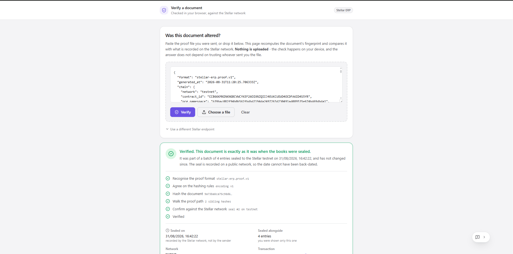
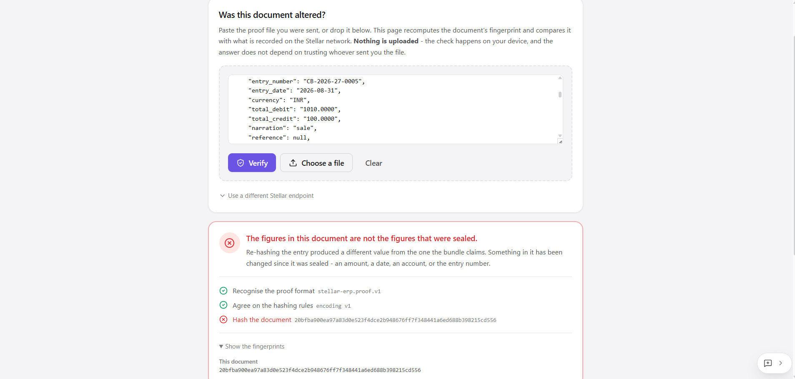
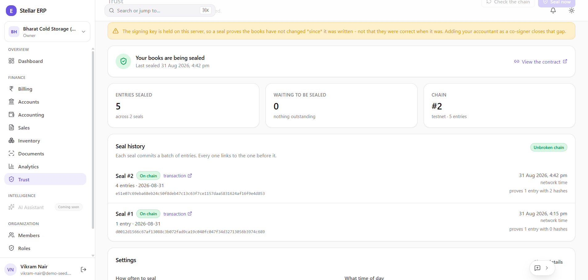
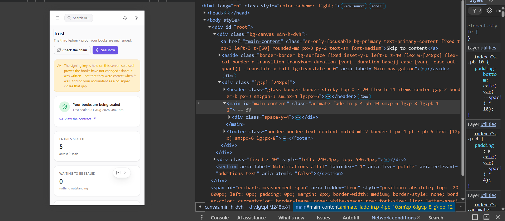
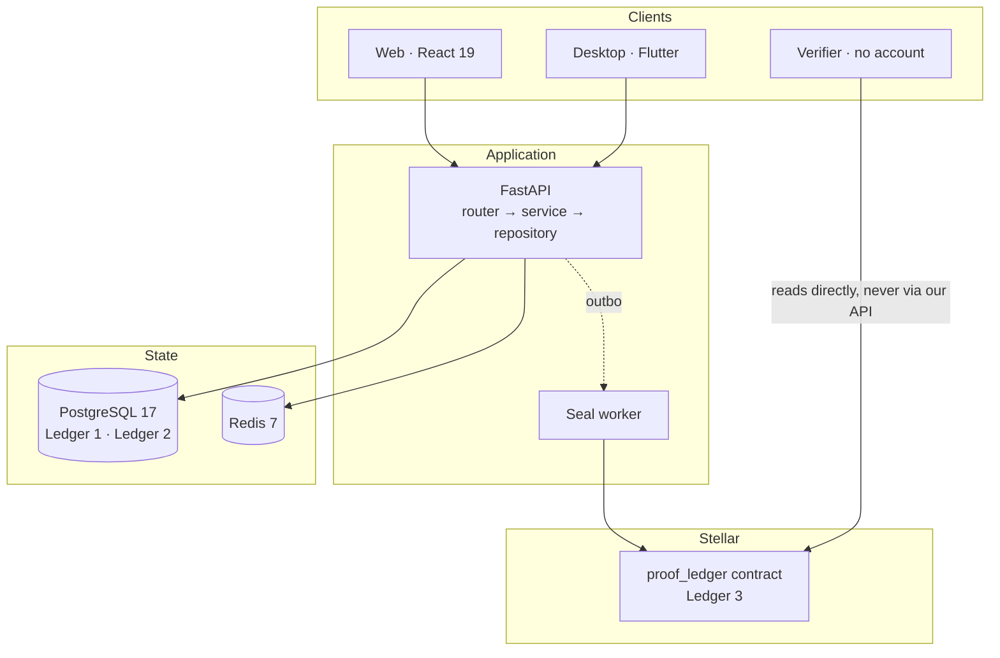

<div align="center">

# Stellar ERP

**A self-hosted ERP whose books a bank can verify - without ever seeing them.**

[](https://stellar-erp-sigma.vercel.app)
[](https://stellar-erp-sigma.vercel.app/verify)
[](https://youtu.be/-84c0-0rdnk)
[](LICENSE)


[Live demo](#live-demo) · [Demo video](https://youtu.be/-84c0-0rdnk) · [The third ledger](#the-third-ledger) · [Verify a proof](#verifying-a-proof) · [Screenshots](#screenshots) · [Quick start](#quick-start) · [Commands](docs/commands.md) · [Documentation](docs/README.md) · [Submission](SUBMISSION.md)

</div>

https://github.com/user-attachments/assets/937cacee-1728-4db6-bf98-d811abc2ab1e

<div align="center"><sub>

**Demo video** - plays above on GitHub, or watch it on [YouTube](https://youtu.be/-84c0-0rdnk)

</sub></div>

> **This is a fork of [Madhur-Prakash/Personal-ERP](https://github.com/Madhur-Prakash/Personal-ERP),
> extended with a third ledger on Stellar.** Personal ERP is the self-hosted
> accounting system underneath - double-entry, GST, purchasing, inventory, OCR,
> analytics. Everything under [The third ledger](#the-third-ledger) is what this
> repository adds, and it is kept deliberately separable: the accounting core does
> not import it, and `ATTESTATION_ENABLED=false` removes it entirely.

---

## Live demo

| | |
| --- | --- |
| **Web client** | **<https://stellar-erp-sigma.vercel.app>** |
| **Verifier** - *no account, no wallet, no backend* | **<https://stellar-erp-sigma.vercel.app/verify>** |
| **Contract** | [`CCB66KMN…S5YR`](https://stellar.expert/explorer/testnet/contract/CCB66KMNINKNGBCVWCYKEF26OIXNZQIIJ4EUKCUOUD4OCDFA6ID4S5YR) on Stellar Testnet |
| **Source** | [github.com/Madhur-Prakash/Stellar-ERP](https://github.com/Madhur-Prakash/Stellar-ERP) |

**Start at `/verify`.** It is the one screen that needs nothing from us: it re-encodes
the entry, folds the Merkle path, and queries a public Soroban RPC endpoint *from your
browser*. There is no API call to our server in that flow at all - which is the whole
point, and why it keeps working on a static host.

**The rest of the app needs a backend, and ours is not public.** The API is
self-hosted on an Ubuntu server that is deliberately kept private - an ERP holds a
business's ledger, its customers and its supplier terms, so a permanently exposed demo
instance full of real double-entry data is not a thing this project is willing to
publish. That is the same argument the product itself makes: the books stay private,
and only the proof is public.

So signed-in screens on the hosted client will not connect. To see them, run the stack
yourself - **[Quick start](#quick-start)** is two commands - or look at
**[Screenshots](#screenshots)**.

| Want to… | Where |
| --- | --- |
| Check a proof someone sent you | [The live verifier](https://stellar-erp-sigma.vercel.app/verify) - works right now |
| Inspect the contract without trusting us | [Six ways](docs/commands.md#6-seeing-the-deployed-contract), two of which trust us not at all |
| See the signed-in product | [Screenshots](#screenshots), or [run it locally](#quick-start) |
| Watch tamper-evidence happen | [Demonstrating it](docs/commands.md#7-demonstrating-that-the-records-are-tamper-evident) |

---

## The problem

Small businesses are offered two bad options for running their books. Cloud SaaS
rents you your own accounts and raises the price once you depend on it. Legacy
desktop software lives on one machine and dies with its hard drive. Personal ERP is
the third option: your server, your PostgreSQL, no vendor in between.

**But sovereignty costs you credibility, and nobody puts that on the invoice.**

This ERP already keeps two ledgers, and both are built carefully. Posted journal
entries have no edit path - correction is by reversal. The audit trail has no
`updated_at`, because a log that can be edited is not evidence.

All of that is real engineering and all of it is worthless to a third party. Those
guarantees are enforced by *the absence of code that violates them*, which protects
the business against its own staff and its own bugs, and protects nobody at all
against the business. Two minutes in `psql` and both ledgers agree, in flawless
double-entry, on a history that never happened.

So the books are useless to exactly the people who most need to read them. A bank
underwriting a working-capital line asks for bank statements instead, and prices the
difference as risk. A corporate buyer running supplier diligence cannot use them.
Neither can a marketplace, an insurer, or an investor.

The answer is **not** to put the books on a blockchain - publishing a business's
ledger exposes its margins, customers, supplier terms and salaries, and in India it
runs straight into the DPDP Act. The real problem is narrower and harder:

> **Make a private ledger provably unaltered to a stranger who never sees anything
> inside it.**

---

## The third ledger

| | | |
| --- | --- | --- |
| **Ledger 1** | The **journal** | Double-entry accounting. What happened to the money. Your PostgreSQL. |
| **Ledger 2** | The **audit trail** | Append-only record of who did what, with field-level diffs. Your PostgreSQL. |
| **Ledger 3** | The **proof ledger** | A Soroban contract on Stellar holding cryptographic commitments to Ledger 1. **No business data. No money.** |

Every accounting period - daily by default - the system hashes each journal entry
into a Merkle leaf, computes the batch's root, and writes it to the contract with an
entry count, a control total, and the window it covers. Later, anyone the business
chooses can be handed **one invoice** plus about `log₂(n)` sibling hashes and check
it against that root, in their own browser, against a public Soroban RPC.

They need no wallet, no account, no seed phrase, and no idea that a blockchain is
involved.

### What a seal proves

> The books presented today are **byte-identical** to the books that existed when
> the seal was written, and the seal was written at a time the network attests to
> and the business cannot back-date.
>
> It does **not** prove the entries were true when they were made. No cryptographic
> scheme can. What it eliminates is **retroactive** fabrication - which is how
> accounts are actually cooked: by editing history to fit a story told later.

You can watch this rather than take it on faith:
**[demonstrating tamper-evidence](docs/commands.md#7-demonstrating-that-the-records-are-tamper-evident)**
walks through posting entries, sealing them, exporting a proof, altering one digit
of it, and watching verification fail at a nameable step - the recomputed leaf no
longer folds to a root that was published before the edit was made.

That limitation is on the Trust screen, not buried here. So is the sharper one:
while the signing key sits on the server, the operator could doctor the books
*before* sealing - which is why the default cadence is daily, why the seals form a
hash chain the network timestamps, and why `POST /attestation/signer/rotate` moves
the book onto a 2-of-3 multisig with the business's accountant.

### Why Stellar

**Cost is the feasibility argument, not a nice-to-have.** A proof written once a
year leaves a twelve-month window in which history can be rewritten freely - which
is exactly the window fraud lives in. Stellar charges under one US cent per hundred
thousand operations, so sealing *every day* costs less than the electricity the
server draws computing the root. On a gas-priced network the same product must
either seal rarely and destroy the guarantee, or charge more than the software
costs.

Three more, in short: **Soroban enforces rather than stores** - the contract refuses
a skipped sequence, so a gap is evidence rather than an absence; **native multisig
is a protocol primitive**, so 2-of-3 co-signing is a `set_options` call rather than
a contract to write and audit forever; and **the road from proof to money is on the
same network** - SEP-24/31 anchors, SEP-41 receivables - though that work is gated
and not built.

Full reasoning, and every decision behind the implementation, in
**[docs/attestation.md](docs/attestation.md)**.

### Deployed contract

| | |
| --- | --- |
| **Network** | Stellar Testnet |
| **Contract** | [`CCB66KMNINKNGBCVWCYKEF26OIXNZQIIJ4EUKCUOUD4OCDFA6ID4S5YR`](https://stellar.expert/explorer/testnet/contract/CCB66KMNINKNGBCVWCYKEF26OIXNZQIIJ4EUKCUOUD4OCDFA6ID4S5YR) |
| **Wasm hash** | `2324b519f8a205a8cae31e1b8ebf3944be1bc5d1d6ec7028cdea3829f5e79246` |
| **Source** | [`contracts/proof_ledger`](contracts/README.md) - 15 KB of wasm, 8 exported functions, 28 adversarial tests |

`make contract-build` reproduces that exact hash from this source, so anyone can
confirm the deployed bytes are the bytes in this repository.

---

## Verifying a proof

The whole design exists for this flow, so it is worth reading even if you never run
the ERP.

1. A business opens **Trust** and presses **Seal now** (or lets the daily schedule
   do it). The batch's root goes on chain.
2. On any invoice, it exports a **proof bundle** - a small JSON file containing that
   one entry, its Merkle path, the seal reference, and the encoding spec.
3. It emails the file to its bank.
4. The bank opens **`/verify`**, drops the file in, and gets a verdict.

Step 4 runs **entirely in the reader's browser**. It re-encodes the entry, hashes
it, folds the Merkle path, and asks the contract directly whether that root is what
it holds - over an RPC endpoint the reader can change, on screen. Our API is not
consulted for the answer at any point, which is the only reason the answer is worth
anything.

There is also a CLI, for a business checking a bundle before it sends one and for
a counterparty who would rather not run a browser:

```bash
make verify-proof f=bundle.json          # against the live chain
```

It exits 0 or 1, so it fits in a pipeline. It is **our** code, and it says so in its
own output - which is exactly why the browser verifier exists as well.

That is why the hashing rules are implemented **twice** - once in
[Python](backend/app/modules/attestation/canonical.py), once in
[TypeScript](frontend/src/features/trust/canonical.ts) - and why
[a test asserts the two produce identical bytes](frontend/src/features/trust/canonical.test.ts)
against a pinned golden vector on every CI run. A single shared implementation would
be cheaper and would mean the verifier is running our code.

---

## What exists today

<table>
<tr><th align="left">Area</th><th align="left">Capability</th></tr>

<tr><td><b>Ledger 3</b></td><td>

- Soroban contract enforcing append-only sequencing and hash-chain continuity
- Frozen, versioned canonical encoding with golden-vector tests in two languages
- RFC 6962 Merkle trees, so one invoice proves without revealing the rest
- Transactional outbox and a reconciler, so a chain outage never blocks a month-end close
- Public, wallet-free verifier that never calls our API
- Trust screen on web and desktop, leading with the age of the unsealed backlog

</td></tr>

<tr><td><b>Platform</b></td><td>

- Monorepo with Docker Compose for development and production
- FastAPI backend · PostgreSQL 17 · Redis 7
- React 19 + TypeScript + Vite web client - responsive down to a phone: the sidebar
  becomes a drawer, every grid collapses to one column, and 64-character hashes wrap
  instead of pushing the page sideways
- Flutter desktop client for Windows, macOS and Linux - same screens, same API
- Alembic migrations: reversible and drift-checked
- Optional Sentry error tracking, with a scrubber that drops request bodies and SQL parameters
- First-party usage analytics in your own PostgreSQL, and an open feedback endpoint
- `GET /attestation/adoption` - who on this install is really sealing, with the transaction hashes to check it independently

</td></tr>

<tr><td><b>Identity</b></td><td>

- Password, email verification, magic link, email OTP, password reset by emailed code
- TOTP two-factor with recovery codes
- Refresh-token rotation with reuse detection, device history, remote revocation
- Organizations, members, invitations
- RBAC: 46 permissions, 5 seeded roles, custom roles, per-member overrides
- Immutable audit trail with field-level diffs

</td></tr>

<tr><td><b>Money</b></td><td>

- **Billing** - record money in and out with a date, an amount and a note. Posts real double-entry
- **Accounts & cards** - bank accounts (encrypted numbers; **no card PAN stored at all**), transfers
- Double-entry accounting - chart of accounts, journals, period locks, trial balance, P&L, balance sheet, cash flow

</td></tr>

<tr><td><b>Trade</b></td><td>

- Sales - customers, leads, quotations, orders, GST invoices, payment allocation, receivables ageing
- Purchasing & inventory - suppliers, POs, goods receipt, weighted-average valuation, bills, input GST, payables ageing
- Document intelligence - invoice upload, field extraction with per-field confidence, GSTIN matching, duplicate warnings

</td></tr>

<tr><td><b>Insight</b></td><td>

- Analytics - real dashboard figures, like-for-like comparison, twelve-month trend, rankings
- Control-account reconciliation - receivables, payables and stock derived twice and compared
- Design system, light/dark/system theming, command palette

</td></tr>
</table>

> **There is no OAuth.** Sign-in is email/password plus the passwordless options
> above, by design: a self-hosted deployment should not have to register an
> application with Google to let its own staff sign in.

### Optional: reading scanned invoices

Document intelligence is an extra, not a default:

```bash
cd backend && uv sync --extra ocr
```

`pypdf` reads digital PDFs immediately. **Scanned images additionally need the
Tesseract binary**, which pip cannot install - so
`GET /api/v1/documents/capabilities` reports what the running server can actually
read, and the UI says so plainly rather than offering an upload that fails.

The heavyweight engines - layout-aware transformers, cloud document AI - are
deliberately absent. They would multiply the image size and the memory floor of a
deployment whose whole promise is that one person can run it on a small VPS, and the
extraction is a *suggestion a human confirms* either way. Confirming calls
`BillService.create`, the same entry point `POST /bills` uses, so a machine-read bill
is protected by every rule that protects a hand-entered one.

---

## Screenshots

<table>
<tr>
<td width="50%" valign="top">



**`/verify`, signed out** - "Nothing is uploaded". A real Merkle path folds, and the contract is asked over an RPC endpoint the reader can change.

</td>
<td width="50%" valign="top">



**One field changed** - `total_debit` 100 → 1010. It fails at *Hash the document*, before it ever reaches the network.

</td>
</tr>
<tr>
<td width="50%" valign="top">



**Trust** - two seals, an unbroken chain, `WAITING TO BE SEALED · 0`, and the signing-key limitation stated at the top.

</td>
<td width="50%" valign="top">



**Mobile**, 360 × 740 - tiles stacked, nothing clipped, and the limitation banner survives the narrow viewport.

</td>
</tr>
</table>

Four of twenty-two. The rest - the audit log with the full seal lifecycle, the
dashboard, analytics, the double-entry core, roles, the feedback widget and its
table, three **monitoring** shots, and six more mobile viewports - are in
**[docs/screenshots.md](docs/screenshots.md)**, at full size, each with what it shows and
why that shot rather than another.

---

## Quick start

**Requires** Docker, plus [uv](https://docs.astral.sh/uv/) and Node 24 for running
outside containers. The contract additionally needs Rust and the
[Stellar CLI](https://developers.stellar.org/docs/tools/developer-tools).

```bash
git clone https://github.com/Madhur-Prakash/Stellar-ERP.git && cd Stellar-ERP
make setup          # creates .env, installs deps, starts services, migrates
make up             # starts the whole stack
```

| Service | Address |
| --- | --- |
| Frontend | <http://localhost:5173> |
| **Verifier** (no account needed) | <http://localhost:5173/verify> |
| API | <http://localhost:8000> |
| API reference | <http://localhost:8000/docs> |
| Desktop client | `make desktop` - a native window, not a URL |

Register at <http://localhost:5173/register>, then open **Trust** and switch sealing
on.

The hosted client at <https://stellar-erp-sigma.vercel.app> is the same build without a
backend behind it, so `/verify` works there and the signed-in screens do not - see
[Live demo](#live-demo) for why the API is not exposed.

`make help` lists every task. **[docs/commands.md](docs/commands.md) gives every one
of them twice - as a `make` target and as the raw commands it runs** - so you are
never forced through the wrapper to know what it does.

### Deploying your own contract

The repository is preconfigured against the testnet contract above. To deploy your
own, one command does all of it:

```bash
make contract-up
```

That runs the contract's tests, builds the wasm and prints its hash, creates and
funds a testnet key if you have none, deploys, **reads the contract back off the
network to prove it is really there**, and writes every setting the application
needs into `.env` - the backend's and the frontend's, because the browser reads the
contract itself and cannot be handed those at runtime. Mainnet is
`make contract-up ARGS="--network public --yes"`.

Two things it refuses to do quietly, both because they are irreversible:

- **Replacing an existing contract id needs `ARGS="--force"`.** A new contract is a
  new, empty book - every organization that has already sealed keeps its seals on
  the old one, and every proof already sent to a bank points at an address this
  install no longer uses.
- **It never overwrites `ATTESTATION_NAMESPACE_SALT`.** It generates one when
  absent and leaves it alone forever after, because rotating it orphans every book
  on chain, permanently.

Then `make up` to restart the API, and `make build` for the web client - `VITE_*`
values are inlined at build time, so a restart alone will not pick them up.

> **Getting the verification email.** Mail goes through the Gmail API and nothing
> else, so delivery depends on `GMAIL_CREDENTIALS_B64` - see
> [Email in development](docs/development.md#email-in-development). With no
> credentials, emails are written to the log; logifyx masks `token=...` out of the
> URL, so set `LOG_MASK=false` to make the link usable locally.

---

## Architecture



**Note the one dashed line and the one direct line.** The seal worker is the only
thing that waits on consensus, and it is never in a request path. The verifier
reaches the contract without touching our servers at all - which is the entire
point.

**Dependencies point inward** - `router → service → repository → models`:

| Layer | Knows about | Never touches |
| --- | --- | --- |
| `router.py` | FastAPI, HTTP | Business rules |
| `service.py` | Business rules, domain errors | HTTP, requests |
| `repository.py` | The database session | Business rules |
| `models.py` | Tables and columns | Everything above |

That rule is why **accounting does not import attestation**. The posting engine
announces that an entry was posted
([`accounting/hooks.py`](backend/app/modules/accounting/hooks.py)) and has no idea
the proof ledger is listening; attestation subscribes once, from the composition
root. Wiring it directly into `PostingService` would have made the ledger
undeployable without the blockchain subsystem.

### Project layout

```
.
├── contracts/               Soroban · Rust · the proof ledger
│   └── proof_ledger/        8 functions, 28 adversarial tests, 15 KB wasm
├── backend/                 FastAPI · Python 3.13 · uv
│   ├── app/
│   │   ├── core/            Config, logging, security, monitoring, middleware
│   │   ├── db/              Base, mixins, session, model registry
│   │   ├── modules/         One vertical slice per bounded context
│   │   │   ├── accounting/  Ledger 1, and the hook seam other modules subscribe to
│   │   │   ├── audit/       Ledger 2
│   │   │   ├── attestation/ Ledger 3 - canonical, merkle, stellar, worker
│   │   │   └── feedback/    Feedback and first-party usage analytics
│   │   └── api/v1/          Router aggregation
│   ├── migrations/          Alembic
│   └── tests/               pytest, against real PostgreSQL + Redis
├── frontend/                React 19 · TypeScript · Vite · Tailwind v4
│   └── src/features/
│       ├── trust/           The Trust screen, and the TS canonical encoding
│       └── verify/          The public verifier
├── app_frontend/            Flutter desktop client · Windows · macOS · Linux
├── installer/               Inno Setup script for the Windows desktop build
└── docs/                    Twelve documents - start at docs/README.md
```

---

## Design decisions worth knowing

Each is explained where it lives, in the code.

| Decision | Rationale | Source |
| --- | --- | --- |
| **An entry's status is not hashed** | This ledger corrects by reversal, so `posted` → `reversed` is the normal path. Hashing it meant reversing an entry invalidated its own proof - the subsystem accused a business of tampering for doing the right thing | [`canonical.py`](backend/app/modules/attestation/canonical.py) |
| **The chain is the authority on what has been sealed** | A submission whose outcome is unknown may still have landed. Retrying risks a double seal; not retrying risks a gap, which is indistinguishable from tampering. So the contract enforces idempotency and a reconciler corrects local state from `latest()` | [`attestation/service.py`](backend/app/modules/attestation/service.py) |
| **The seal row *is* the outbox** | A separate outbox table would be a second record of the same fact, and the day they disagree nobody can tell whether the chain is behind or the database is lying | [`attestation/models.py`](backend/app/modules/attestation/models.py) |
| **Batching is by posting order, not by month** | A bill for March arrives on 3 April. If the unit were the month, either a published root would have to change or those entries would never be sealed | [`attestation/models.py`](backend/app/modules/attestation/models.py) |
| **The canonical encoding exists twice** | A verifier who called our server for a verdict has gained nothing. The duplication is the cost of the answer being independent, and a test pins the two together | [`canonical.test.ts`](frontend/src/features/trust/canonical.test.ts) |
| **The Stellar SDK is dynamically imported** | It is ~940 kB the billing screen has no use for. `manualChunks` overrode the split at first and put it in front of every page load; it now has its own async chunk | [`vite.config.ts`](frontend/vite.config.ts) |
| **Access tokens in memory; refresh tokens in an HttpOnly cookie** | `localStorage` is readable by any XSS, and a stolen token is valid until it expires | [`lib/api.ts`](frontend/src/lib/api.ts) |
| **Refresh tokens rotate; reuse is treated as a breach** | Presenting an already-rotated token means two parties hold it and we cannot tell which is legitimate | [`auth/service.py`](backend/app/modules/auth/service.py) |
| **The active organization comes from the signed token, never the URL** | No organization id in any path for a client to tamper with, making cross-tenant access structurally impossible rather than merely checked | [`organizations/router.py`](backend/app/modules/organizations/router.py) |
| **Permissions are code; roles are data** | A permission is a capability the software implements, so the enum *is* the contract - greppable, and unable to drift from a table | [`rbac/permissions.py`](backend/app/modules/rbac/permissions.py) |
| **Error reports drop request bodies entirely** | A `ValidationError` on an invoice carries the invoice. There is no subset of that safe to send to a third party | [`core/monitoring.py`](backend/app/core/monitoring.py) |
| **Usage analytics has no free-text payload column** | An events table with an open payload is how an analytics table ends up inside the compliance boundary | [`feedback/service.py`](backend/app/modules/feedback/service.py) |
| **UUIDv7 primary keys** | Time-ordered, so inserts append to the right edge of the index instead of scattering | [`db/base.py`](backend/app/db/base.py) |

---

## The stack

| Layer | Technologies |
| --- | --- |
| **Contract** | Rust 1.96 · soroban-sdk 27 · wasm32v1-none |
| **Backend** | FastAPI · Python 3.13 · uv · SQLAlchemy 2 (async) · Alembic · PostgreSQL 17 · Redis 7 · Pydantic v2 · Argon2id · PyJWT · stellar-sdk 15 · [logifyx](https://pypi.org/project/logifyx/) |
| **Frontend** | React 19 · TypeScript · Vite 7 · Tailwind CSS v4 · TanStack Router/Query/Table · Zod · Recharts · `@stellar/stellar-sdk` (lazy) · Vitest |
| **Desktop** | Flutter 3.44 · Dart 3.12 · Material 3 · Riverpod · go_router · Dio with a persisted cookie jar |
| **Infrastructure** | Docker Compose · GitHub Actions · Inno Setup |

---

## Everyday commands

```bash
make check              # lint + typecheck + test, every surface
make contract-up        # test, build, deploy the contract, and write .env
make contract-test      # the contract's 28 adversarial tests
make test               # backend pytest, frontend vitest, flutter test
make db-check           # migrations round-trip and match the models
make seal-worker        # run the seal worker standalone
make verify-proof f=b.json   # check an exported proof bundle against the chain
```

Every target, its raw equivalent, and a troubleshooting table:
**[docs/commands.md](docs/commands.md)**.

### Quality gates

| Backend | Frontend | Desktop | Contract |
| --- | --- | --- | --- |
| `ruff check` | `npm run lint` | `dart format` | `cargo clippy -D warnings` |
| `mypy --strict` | `tsc -b` | `flutter analyze` | - |
| `pytest` | `npm test` | `flutter test` | `cargo test` |
| `alembic check` | `npm run build` | - | `stellar contract build` |

**Current state:** 1,217 backend tests, 42 frontend tests, 105 desktop tests, 28
contract tests. `ruff` and `mypy --strict` clean across 132 modules; `eslint
--max-warnings 0` and `tsc -b` clean; `flutter analyze` clean; `alembic check`
reports no drift.

> **On Windows, run raw commands from PowerShell, not Git Bash.** MSYS rewrites
> environment values that look like Unix paths, so `API_V1_PREFIX=/api/v1` reaches
> Python as `C:/Program Files/Git/api/v1` and the app dies at import. **`make`
> targets are safe from either shell** - the [Makefile](Makefile) resolves Git Bash
> explicitly and sets `MSYS2_ENV_CONV_EXCL=*`.

---

## How it is checked

**Against real infrastructure, not mocks.** The backend suite runs on PostgreSQL 17
and Redis 7 in containers, because the things worth testing here - partial unique
indexes, `SELECT … FOR UPDATE` under concurrency, JSONB behaviour - are exactly what
a substitute engine implements differently. Passing against SQLite would prove
nothing.

The proof ledger is tested three ways, because it has three kinds of failure:

| What | How | Why that way |
| --- | --- | --- |
| **The contract** | 28 Rust tests, written adversarially | Its value is what it *refuses*, so most assert a panic. A suite proving only that sealing works would prove nothing worth knowing |
| **The application** | An in-memory fake chain enforcing the contract's rules | The hardest logic is what happens when a submission's outcome is **unknown**, and that is not a condition you can wait for on a real network |
| **The two encodings** | A shared golden vector, asserted in Python and TypeScript | If they drift, every proof fails with "the figures do not match" - accusing honest businesses of tampering |

Three tests are worth naming, because each found a real defect:

- **`test_a_sealed_period_stays_sealed_when_an_entry_is_reversed_later`** - posts in
  March, seals, reverses in May, seals again, and asserts March's proof still
  verifies. This found the `status`-in-the-hash bug.
- **`test_a_failed_seal_lets_its_sequence_be_reused`** - found that an unconditional
  unique index meant a failed seal permanently blocked its own replacement.
- **`test_an_unknown_outcome_parks_the_seal_for_the_reconciler`** - makes a
  submission land but time out, and asserts it is never submitted twice.

---

## Documentation

**[docs/](docs/README.md)** is the index. Fourteen documents, each explaining *why*
as well as what.

| Document | Contents |
| --- | --- |
| [**Proof ledger**](docs/attestation.md) | **The third ledger:** what a seal proves and does not, the canonical encoding, the Merkle tree, the ambiguous failure, why Stellar |
| [Specification](docs/spec.md) | Product goals, modules, delivery model, non-negotiables |
| [Architecture](docs/architecture.md) | Layering, request lifecycle, module structure, diagrams |
| [Database](docs/database.md) | Schema, ER diagram, indexes, migration workflow |
| [Accounting](docs/accounting.md) | Double-entry invariants, exact money, reversals, numbering, fiscal calendar |
| [API](docs/api.md) | Auth flows, error contract, pagination, endpoints |
| [Security](docs/security.md) | Threat model and every control, with rationale |
| [Security audit](docs/security-audit.md) | Findings against running code, each with its fix and how to verify it |
| [**Commands**](docs/commands.md) | **Every task as `make` and as raw commands.** Setup, running, the database, deploying the contract, six ways to inspect the deployed contract, demonstrating tamper-evidence, troubleshooting |
| [Screenshots](docs/screenshots.md) | Every shot at full size, what each must have in frame, and the capture rules |
| [Demo video](docs/demo-video.md) | The three-minute script: shot list, timings, narration, and the mistakes that ruin a take |
| [Evidence](docs/evidence.md) | Generated by `make evidence` from the live database and ledger - wallet interactions, feedback, usage, every on-chain figure linked to an explorer |
| [Development](docs/development.md) | Local workflow, conventions, testing, adding a module |
| [Deployment](docs/deployment.md) | VPS setup, the proxy you supply, backups, updates, pre-flight checklist |

The Level 4 submission checklist, with evidence and what is still outstanding, is
**[SUBMISSION.md](SUBMISSION.md)**.

Also: [`contracts/README.md`](contracts/README.md) for the contract,
[`backend/README.md`](backend/README.md), [`frontend/README.md`](frontend/README.md),
[`app_frontend/README.md`](app_frontend/README.md).

---

## Delivery status

| Stage | Scope | Status |
| --- | --- | --- |
| **1 · Foundation** | Monorepo, Docker, auth, orgs, RBAC, audit, CI, design system | Complete |
| **2 · Accounting core** | Chart, journals, double-entry, statements, period locks | Complete |
| **3 · Customers & sales** | CRM, quotations, orders, GST invoices, payments | Complete · *PDF pending* |
| **4 · Purchases & inventory** | Suppliers, POs, goods receipt, weighted-average valuation, GRNI | Complete |
| **5 · Document intelligence** | Extraction with per-field confidence, GSTIN matching, duplicates | Complete |
| **6 · AI assistant** | Conversational interface, RAG, forecasting | Planned |
| **7 · Automation** | Workflow builder, triggers, approvals | Planned |
| **8 · Analytics** | Dashboard figures, comparisons, trends, control reconciliation | Complete |
| **9 · Enterprise** | API keys, webhooks, SSO, passkeys | Planned |
| **10 · Production hardening** | Security review, monitoring, load testing, tuning | Monitoring and analytics complete; load testing pending |
| **11 · Ledger 3** | **Soroban contract, canonical encoding, seal worker, public verifier, Trust screens** | **Complete** |
| **12 · Settlement** | SEP-24/31 anchors, tokenised receivables, invoice financing | **Gated** - requires Stellar Builder Team approval |

The numbering is the original build order, so **11 came out of sequence on purpose**:
the third ledger was the point of this fork, and the planned stages above it were
not worth blocking it.

Stage 12 is deliberately not built. Levels 4, 5 and 6 of the Stellar Builder
programme are locked, and every claim above holds without them.

Modules not yet built appear in the navigation as visibly disabled entries rather
than links to nothing.

---

## Contributing

| | |
| --- | --- |
| **Found a bug** | Open a bug report - include the commit SHA and how to reproduce it |
| **Want a feature** | Open a feature request - check [Delivery status](#delivery-status) first |
| **Sent feedback in-app** | The Feedback button on any screen works signed out too, and lands in `POST /feedback` |

Before opening a PR: `make check` must pass, and `make contract-test` if you touched
`contracts/`. See [CONTRIBUTING.md](CONTRIBUTING.md).

---

<div align="center">

### [MIT](LICENSE) · © 2026 Madhur Prakash Mangal

Forked from [Personal-ERP](https://github.com/Madhur-Prakash/Personal-ERP) · Built on [Stellar](https://stellar.org)

</div>
