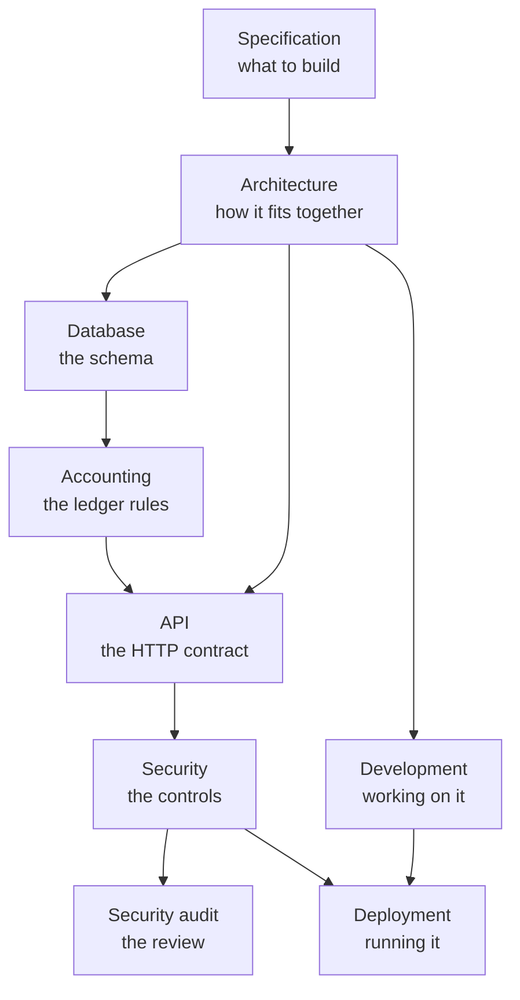

# Documentation

**Nine documents covering what this system is, how it is built, and how to run it.**

[Spec](spec.md) · [Architecture](architecture.md) · [Database](database.md) · [Accounting](accounting.md) · [API](api.md) · [Security](security.md) · [Audit](security-audit.md) · [Development](development.md) · [Deployment](deployment.md)

---

Every one of them explains **why** as well as what. Where a common alternative was
rejected, the reason is written down - a decision whose rationale nobody remembers is a
decision that gets undone in the next refactor.

Every page carries the nav bar above, so you are never more than one click from any
other, and ends with three suggestions for where to go next.

---

## Start here

Pick the row that matches what you are trying to do.

| I want to… | Read, in order |
| --- | --- |
| **Run it on my machine** | [Development](development.md) → [Architecture](architecture.md) |
| **Put it on a server** | [Deployment](deployment.md) → [Security](security.md) |
| **Understand the money model** | [Accounting](accounting.md) → [Database](database.md) |
| **Call the API** | [API](api.md) → [Security](security.md#authentication) |
| **Review the security posture** | [Security](security.md) → [Security audit](security-audit.md) |
| **Add a feature** | [Architecture](architecture.md#extending-it) → [Development](development.md) → [Database](database.md#migrations) |
| **Know what this is meant to be** | [Specification](spec.md) |

---

## The documents

| Document | What is in it |
| --- | --- |
| [**Specification**](spec.md) | The requirements: product goals, module breakdown, delivery model, and the non-negotiables everything else is measured against. |
| [**Architecture**](architecture.md) | Layering and the inward-pointing dependency rule, the request lifecycle end to end, module structure, and how the frontend is organised. |
| [**Database**](database.md) | Schema and entity relationships, naming conventions, the indexes and why each exists, migrations, transactions, and backups. |
| [**Accounting**](accounting.md) | The double-entry core: the invariants, why money is never a float, why entries are reversed rather than edited, numbering, and the fiscal calendar. |
| [**API**](api.md) | The HTTP contract: authentication flows, the error envelope, endpoints, pagination, and rate limits. |
| [**Security**](security.md) | The threat model and every control, each with its rationale - network edge, authentication, sessions, authorization, input handling, secrets, and rate limiting. |
| [**Security audit**](security-audit.md) | A full review of the exposure surface: sixteen findings, each verified against the code, with the fix applied and how to confirm it. Two carry supersession notes where the system has since changed. |
| [**Development**](development.md) | Local setup, backend and frontend conventions, testing, the pre-PR checklist, debugging, and the gotchas hit while building this. |
| [**Deployment**](deployment.md) | Self-hosting on a VPS: configuration, the proxy you have to supply, backups, updates, and a pre-flight checklist. |

---

## How they relate

Read top to bottom for the whole picture; jump straight to a box if you already know
where you are going.

---

## Elsewhere in the repository

| | |
| --- | --- |
| [Root README](../README.md) | What the product does, quick start, everyday commands, and the design decisions worth knowing before reading any of the above. |
| [`backend/README.md`](../backend/README.md) | The FastAPI service - layout, commands, configuration, optional extras. |
| [`frontend/README.md`](../frontend/README.md) | The React web client - structure, conventions, design tokens. |
| [`app_frontend/README.md`](../app_frontend/README.md) | The Flutter desktop client, and the four places a native window honestly differs from a browser. |
| [`installer/README.md`](../installer/README.md) | Packaging the Windows build with Inno Setup. |
| `/docs` (running app) | Interactive OpenAPI reference, generated from the code. Development only - it is disabled in production and returns 404 there, so [API](api.md) is the written contract. |
