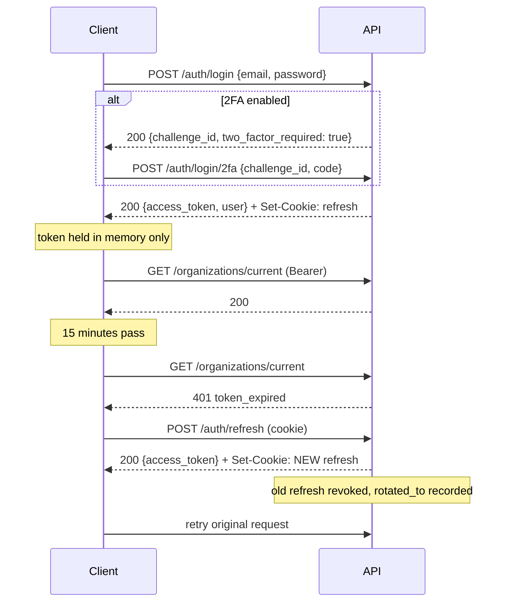

<div align="center">

# API

**The HTTP contract: auth flows, the error envelope, endpoints, pagination, limits.**


<!-- nav:start -->
[Docs](README.md) · [Spec](spec.md) · [Architecture](architecture.md) · [Database](database.md) · [Accounting](accounting.md) · [Proof ledger](attestation.md) · **API** · [Security](security.md) · [Audit](security-audit.md) · [Commands](commands.md) · [Screenshots](screenshots.md) · [Demo video](demo-video.md) · [Evidence](evidence.md) · [Development](development.md) · [Deployment](deployment.md)
<!-- nav:end -->

</div>

---

Base: `/api/v1`. Interactive docs at `/docs` - **development only**, disabled in
production by the app itself rather than left to a proxy to hide.

All bodies are `snake_case`, matching the database and the frontend types. One
name per field, everywhere.

---

## Authenticating

```
Authorization: Bearer <access_token>
```

Access tokens last 15 minutes. Refresh tokens arrive as an
`HttpOnly; Secure; SameSite=Strict` cookie scoped to `/api/v1/auth` and are
rotated on every use.

### The flow



The client's refresh is **single-flight**: when a token expires, every in-flight
request 401s at once, and independent refreshes would present the same
already-rotated token - which the server correctly treats as a breach and responds
to by revoking the session. See [`lib/api.ts`](../frontend/src/lib/api.ts).

---

## Error contract

Every failure, from every endpoint:

```json
{
  "error": {
    "code": "permission_denied",
    "message": "You do not have permission to perform this action",
    "details": { "required_permission": "invoice:approve" },
    "request_id": "01930f4c-8a2b-7c1d-9e3f-4a5b6c7d8e9f"
  }
}
```

Branch on `code`, never on `message`.

| Status | Meaning |
| --- | --- |
| 400 | Malformed request |
| 401 | Not authenticated, token invalid/expired, or 2FA required |
| 403 | Authenticated but not permitted; or email unverified; or account disabled |
| 404 | Not found - also returned for another tenant's resources |
| 409 | Conflict (duplicate email, pending invitation, slug taken) |
| 422 | Validation failure, or a business-rule violation |
| 423 | Account temporarily locked |
| 429 | Rate limited - see `Retry-After` |
| 503 | A dependency is unavailable |

### Notable codes

| Code | Status | Meaning |
| --- | --- | --- |
| `invalid_credentials` | 401 | Wrong email *or* password - deliberately indistinguishable |
| `two_factor_required` | 401 | Password accepted; submit a code. `details.challenge_id` |
| `email_not_verified` | 403 | Recoverable - offer to resend |
| `account_locked` | 423 | `details.retry_after_seconds` |
| `email_taken` | 409 | Registration only |
| `cannot_remove_owner` | 422 | Transfer ownership first |
| `role_in_use` | 422 | `details.member_count` |
| `no_active_organization` | 403 | Create or join one |

A 422 from Pydantic carries `details.fields` as `{field: message}`, ready to hand
to a form library. A password-policy failure carries `details.password` as a list
of reasons.

---

## Endpoints

221 operations across 175 paths. The tables below cover the platform modules and
scanned documents in prose because their rules are not visible from a schema. For
the commercial modules - accounting, sales, purchasing, inventory - **the generated
OpenAPI schema at `/docs` is the reference**, and it is authoritative: it is
produced from the same Pydantic models the endpoints validate against, so it cannot
drift from the implementation the way a hand-written table does.

### Authentication - `/auth`

| Method | Path | Auth | Notes |
| --- | --- | --- | --- |
| POST | `/register` | - | Optional `organization_name` or `invitation_token`, never both |
| POST | `/verify-email` | - | Single-use token |
| POST | `/resend-verification` | - | Neutral response |
| POST | `/login` | - | Returns tokens **or** a 2FA challenge |
| POST | `/login/2fa` | - | Accepts a TOTP or a recovery code |
| POST | `/refresh` | cookie | Rotates. Body fallback for non-browser clients |
| POST | `/logout` | Bearer | `{all_devices: true}` revokes everything |
| GET | `/me` | Bearer | Full principal: orgs, active org, permissions |
| GET | `/password-policy` | - | The enforced policy |
| POST | `/forgot-password` | - | Emails a 6-digit code. Neutral response |
| POST | `/reset-password` | - | `{email, code, new_password}`. 5 attempts, then the code is destroyed. Revokes all sessions |
| POST | `/change-password` | Bearer | Requires the current password; revokes all sessions |
| POST | `/magic-link` | - | Neutral response. The browser flow |
| POST | `/magic-link/verify` | - | Single-use. Returns tokens for a browser-requested link, or `{device_approved:true, user_code}` for an app's - whoever asked is who signs in |
| POST | `/magic-link/device` | - | For clients that cannot receive the link (the desktop app). Returns `{device_handle, user_code, …}`, neutral |
| POST | `/magic-link/device/poll` | - | `{status:"pending"}`, a 2FA challenge, or the tokens. 401 once spent or expired |
| POST | `/otp` | - | Neutral response |
| POST | `/otp/verify` | - | 5 attempts, then the code is destroyed |
| POST | `/2fa/setup` | Bearer | Returns secret, URI, QR data URI |
| POST | `/2fa/enable` | Bearer | Requires a valid code; returns 10 recovery codes **once** |
| POST | `/2fa/disable` | Bearer | Requires the password |
| POST | `/2fa/recovery-codes` | Bearer | Requires the password; invalidates the old set |
| GET | `/sessions` | Bearer | Device history, current flagged |
| DELETE | `/sessions/{id}` | Bearer | Own sessions only |
| POST | `/switch-organization/{id}` | Bearer | Re-mints the token |
| GET | `/permissions` | Bearer | Resolved live from the database |

### Users - `/users`

| Method | Path | Notes |
| --- | --- | --- |
| GET | `/me` | Own profile |
| PATCH | `/me` | Partial. Cannot change email, `is_active`, or `is_superuser` |
| PATCH | `/me/preferences` | Theme, locale, timezone |
| GET | `/me/stats` | Sessions, organizations, recovery codes remaining |

### Organizations - `/organizations`

Note the absence of an id in these paths. The active organization comes from the
signed token, which is what makes cross-tenant access impossible rather than
merely checked.

**Membership is many-to-many, and there is no cap.** One person can own or belong to
any number of organizations; `POST /organizations` needs only a verified email and
makes the caller owner of the new one. `GET /organizations` returns every membership
and is what a client's organization switcher renders.

Two consequences worth designing a client around:

- **The switcher excludes suspended memberships.** `GET /organizations` lists *usable*
  memberships only, because a suspended member must not be able to switch into that
  organization. A user whose only membership is suspended therefore looks, to the
  client, exactly like a user with no organization at all - and needs a route to
  creating or joining one rather than an empty dashboard.
- **Switching re-mints the token.** Permissions are per-organization and are embedded
  in the access token, so `POST /auth/switch-organization/{id}` issues a new one; the
  old token cannot be pointed at the new organization. A client must also drop every
  cached query, since all of it was scoped to the previous organization.

Creating an organization sets `last_organization_id` but does **not** change the
token already in the caller's hand - so a client that creates one and only refreshes
its profile is still looking at the previous set of books. Switch into it.

| Method | Path | Permission |
| --- | --- | --- |
| GET | `/` | - (own memberships) |
| POST | `/` | verified email |
| GET | `/current` | `organization:read` |
| PATCH | `/current` | `organization:update` |
| DELETE | `/current` | `organization:delete` (owner only; soft delete - see below) |
| POST | `/current/leave` | - (not the owner) |
| GET | `/current/members` | `member:read` |
| PATCH | `/current/members/{id}` | `member:update` |
| POST | `/current/members/{id}/suspend` | `member:update` |
| POST | `/current/members/{id}/reactivate` | `member:update` |
| DELETE | `/current/members/{id}` | `member:remove` |
| GET | `/current/invitations` | `member:read` |
| POST | `/current/invitations` | `member:invite` |
| POST | `/current/invitations/{id}/resend` | `member:invite` |
| DELETE | `/current/invitations/{id}` | `member:invite` |

**Deleting is soft, and there is no way back through the API.** `DELETE /current` sets
`organization.deleted_at`, and `BaseRepository` filters on `deleted_at IS NULL` - so the
organization vanishes for every member at once, while the rows survive intact. There is
**no restore endpoint** for an organization, unlike money accounts and cards which do have
one. Recovery is a database statement:

```sql
UPDATE organization SET deleted_at = NULL WHERE id = '...';
```

Self-hosted means the operator is the only person who can run it. A client should say so
rather than implying an undo exists, and should treat the action as final for anyone
without database access.

**Leaving is not deleting.** `POST /current/leave` removes only the caller's membership,
and that row *is* hard-deleted - rejoining needs a fresh invitation. The owner is refused
(`owner_cannot_leave`) and must hand over or delete instead.

### Invitations - `/invitations`

| Method | Path | Auth | Notes |
| --- | --- | --- | --- |
| GET | `/{token}` | - | Preview. Deliberately minimal - anyone with the link sees this |
| POST | `/accept` | Bearer | For an existing account; new users register with the token |

### Roles - `/roles`

| Method | Path | Permission |
| --- | --- | --- |
| GET | `/permissions` | `role:read` - the full catalogue, grouped |
| GET | `/` | `role:read` |
| POST | `/` | `role:create` |
| GET | `/{id}` | `role:read` - stored grants **and** their expansion |
| PATCH | `/{id}` | `role:update` |
| DELETE | `/{id}` | `role:delete` |

### Audit - `/audit`

| Method | Path | Permission |
| --- | --- | --- |
| GET | `/` | `audit:read` - cursor-paginated, filterable |
| GET | `/actions` | `audit:read` - the action vocabulary |

### Scanned documents - `/documents`

Two permissions guard writing here, and the split is deliberate. `document:write`
covers uploading and rejecting - clerical work. `document:confirm` **plus**
`purchase:write` are both required to turn a document into a bill, because
accepting a machine-read total as money owed is not clerical.

| Method | Path | Permission | Notes |
| --- | --- | --- | --- |
| GET | `/capabilities` | `document:read` | Which engines and formats this server can read. Authenticated: it names installed software |
| POST | `/` | `document:write` | Multipart. Recognises and extracts inline; a file that cannot be read still returns 201 with `status: failed` |
| GET | `/` | `document:read` | Review queue, newest first. Filter by `status`, `kind`, `needs_review`, `q` |
| GET | `/{id}` | `document:read` | Full detail with per-field confidence |
| GET | `/{id}/text` | `document:read` | The recognised text - the only answer to "where did this number come from?" |
| GET | `/{id}/file` | `document:read` | The original bytes, `Content-Disposition: attachment` + `nosniff` + a `sandbox` CSP |
| POST | `/{id}/reextract` | `document:write` | Re-parses the stored text. No engine, no file read - for applying a parser improvement to older documents |
| POST | `/{id}/confirm` | `document:confirm` **and** `purchase:write` | Creates a bill from the **submitted** values via `BillService`, not the extracted ones |
| POST | `/{id}/reject` | `document:write` | A reason is required |
| DELETE | `/{id}` | `document:write` | Soft delete. Refused once the document has become a bill |

Three behaviours worth knowing before integrating:

- **Uploading the same bytes twice is not an error.** The response carries
  `already_uploaded: true` and the document created the first time. Blobs are
  content-addressed by SHA-256, so identical files cannot become two documents.
- **`GET /{id}/file` returns the exact bytes that were uploaded.** They are stored
  compressed in PostgreSQL and decompressed on the way out, which is invisible to the
  client: the response body is byte-identical to the upload and its SHA-256 matches
  `document.sha256`. That is verified on every read, so a corrupted blob fails loudly
  rather than serving a document that is not the one the ledger cites.
- **A likely duplicate invoice is a warning, not a rejection.** When an earlier
  document has the same supplier GSTIN and invoice number, `duplicate` is populated
  and `document.is_duplicate` is true - but the upload succeeds and can still be
  confirmed. The values compared were read by an OCR engine, so refusing a genuine
  invoice over a misread digit would be worse than the manual entry this replaces.
- **Confirming inherits every bill rule**, including the refusal to accept the same
  `supplier_invoice_number` for one supplier twice, period locks, and GST
  resolution. There is no second posting path.

### Analytics - `/analytics`

Every figure is computed by the same `ReportingService` that renders the financial
statements, so a dashboard tile cannot disagree with the P&L or balance sheet behind
it. All require `report:read`.

| Method | Path | Notes |
| --- | --- | --- |
| GET | `/periods` | The selectable windows plus the organization's fiscal-year start. Served so "this financial year" means the same dates on both sides |
| GET | `/dashboard` | Revenue, expenses, gross and net profit with period comparison; cash, receivables, payables, stock as at the window end |
| GET | `/trend` | Income, expenses, and profit per calendar month. Empty months are returned as zeroes, never omitted |
| GET | `/top-customers` | Ranked on **taxable** value, not the invoice total |
| GET | `/top-products` | Grouped by line description, so free-text service lines are counted |
| GET | `/control-checks` | Receivables, payables, and stock derived twice - from the ledger and from the documents - and compared |

Three behaviours that matter when integrating:

- **`change_percent` is `null` when there is no basis.** Going from ₹0 to ₹50,000 is
  not "+100%" and not "+∞" - it is undefined. Render "no prior data"; do not coerce
  it to a number.
- **`comparison` is a real window, and for a month-to-date figure it is truncated.**
  On the 3rd of the month, `span` is 3 days and `comparison` is days 1-3 of the
  previous month - not the whole of it. Comparing 3 days against 30 reports a 90%
  collapse that did not happen. The dates are in the response so this is checkable.
- **`all_agree: false` is data, not an error.** It means a document updated one table
  and not the other. It is reported rather than raised for the same reason
  `TrialBalance.is_balanced` is: a broken figure should be visible, not a 500 on an
  otherwise useful screen.

### Billing - `/billing`

The simple path: money in and money out, with no customer or supplier. Guarded on
`journal:read` / `journal:write` rather than a permission of its own - these entries
*are* journal entries, and a parallel permission granting the same underlying
capability would be security theatre.

| Method | Path | Notes |
| --- | --- | --- |
| GET | `/options` | Categories, money accounts, cards, today in the org's timezone, currency - one call so the form renders complete |
| POST | `/` | Record one movement. Posted immediately, never a draft |
| GET | `/` | The day book, newest first. Filter by `direction`, date range, or description |
| GET | `/summary` | Money in, money out, net, and a count for a window |
| GET | `/{id}` | One entry |
| POST | `/{id}/reverse` | Cancel it by posting the mirror entry |
| POST | `/money-accounts` | Add a cash box or bank account, with optional bank details. `account:write` |
| GET | `/money-accounts/{id}/details` | Bank, holder, and **the full account number**. `account:read` |
| PUT | `/money-accounts/{id}/details` | Set or clear them. `account:write` |
| POST | `/categories` | Add an income or expense category from a name alone |
| GET | `/cards` | Cards on file. `?include_archived=true` for the retired ones |
| POST | `/cards` | Register a card from its number. `account:write` |
| POST | `/cards/{id}/archive` | Stop offering it. Past entries still name it |
| POST | `/cards/{id}/restore` | Offer it again |
| POST | `/transfers` | Move money between two of your own accounts |

Worth knowing:

- **Only `direction`, `amount`, and `description` are required.** The date defaults to
  today in the organization's timezone, and the category and cash account fall back to
  sensible defaults, so a first entry needs no knowledge of the chart of accounts.
- **The fiscal year is created on demand.** Without it the first posting would fail
  with "no accounting period covers this date", which is meaningless to someone who
  never asked for a fiscal calendar.
- **Amounts must be positive.** A correction is a reversal, not a negative entry - a
  ledger records what happened, not the net of it.
- **A reversal does not appear in the list.** `reverse_entry` copies `source_type` onto
  the mirror entry, so without filtering it a cancelled ₹5,000 payment would show twice:
  once struck through and once as a phantom ₹5,000 receipt. The original carries
  `is_reversed`, which is all the user needs; the ledger keeps both rows.
- **These are real postings**, so they reach the trial balance, P&L, cash flow
  statement, dashboard, and analytics trend with nothing else wired up.

#### Cards and transfers

- **No card number is ever stored.** `POST /cards` takes one, checks its length and its
  Luhn digit, derives the scheme and the last four digits, and discards the rest. There
  is no column for it - `backend/tests/test_billing_cards.py` asserts that by querying
  `information_schema.columns` - and `CardRead` has no field to return one in. Keeping a
  PAN would put the whole database inside PCI DSS scope, and the last four digits are
  what a receipt and a bank statement both print anyway.
- **A rejected number is not echoed back.** The 422 handler forwards messages, never
  inputs, and the request schema rejects letters by pattern rather than by quoting the
  value.
- **A credit card is a liability, not cash.** Registering one creates an account under
  Current Liabilities, so spending on it increases what you owe rather than reducing
  what you hold. It appears in the "paid from" picker - you genuinely can pay with it -
  but it is not cash-equivalent, so it stays out of the dashboard's cash figure and the
  cash flow statement.
- **A debit card gets no account of its own.** It names a bank account that already
  exists, because a second account would double-count the same money. That means it
  arrives from `/options` with the *same* `id` as that bank account, distinguished only
  by `card_id` - which is why both clients key their pickers on `card_id ?? id`.
- **A transfer has no category**, because moving your own money is neither earning nor
  spending it. It is tagged `transfer` rather than the day book's source type, so the
  money-in and money-out totals ignore it - counting one would show income that never
  arrived from anywhere. Paying off a credit card is a transfer into the card's
  liability account.

#### Bank details - the opposite decision, deliberately

A **bank account number is stored in full**, Fernet-encrypted, where a card number is not
stored at all. That contrast is intentional, not an inconsistency:

- You must quote a bank account number to be paid, print it on an invoice, and match it
  against a statement. Software that discarded it could not do the job. A card number has no
  remaining use here once the last four digits are known.
- A PAN brings the whole database into PCI DSS scope. A bank account number does not.

It is still encrypted at rest, with the same key material as `app_user.totp_secret`, because
it should not be legible in a stolen dump. `account_number_last4` is kept in the clear beside
it so a list renders without decrypting a row per line.

- **`GET /money-accounts/{id}/details` is the only route that returns the full number**, and
  it is separate from `/options` on purpose: decrypting is then a deliberate request behind
  `account:read`, rather than something every load of the recording screen does for every
  account. `MoneyAccountRead` has no `account_number` field at all.
- **`PUT` replaces the whole set.** An omitted or blank field is cleared, which is how a
  number entered by mistake is removed. Note that `account_number` has a minimum length, so
  clients must *omit* it to clear rather than send `""`.
- **Only a cash-equivalent account can carry details.** "Which bank is Sales Revenue at" is
  not a question; asking it is a 422. A cash box may be asked and is silently given no row -
  it has no bank, no number, and no holder.
- The update route exists because the seeded chart creates "Primary Bank Account" before
  anyone has said which bank that is. Without it, the one account most organizations actually
  use would be the only one that could never carry its own details.
- **A cardholder name is kept in the clear.** PCI DSS permits retaining it - it is the PAN and
  the authentication data (CVV, PIN, stripe) that may not be kept - and a name alone cannot
  be used to transact.

### Proof ledger - `/attestation`

Ledger 3. Four permissions guard it, and the split is the point: `seal:read` is a
viewer's, `seal:write` triggers a seal, `proof:export` hands a document to an
outsider, and `seal:configure` can switch the whole thing off. The seeded accountant
role holds the first three and **not** the fourth - somebody who keeps the books
should be able to prove them and unable to stop proving them.

| Method | Path | Permission | Notes |
| --- | --- | --- | --- |
| GET | `/status` | `seal:read` | The screen's one call. **`days_unsealed` is the figure that matters** - a seal count says nothing about now |
| GET | `/network` | authenticated | Network, contract id, RPC url, explorer base. Everything a client needs to read the chain itself |
| GET | `/spec` | authenticated | The frozen canonical encoding: version, field order, money scale, sentinels |
| GET | `/seals` | `seal:read` | Cursor-paginated seal history, newest first |
| POST | `/seals` | `seal:write` | Seal now. Returns the seal with its transaction hash, or the reason there was nothing to seal |
| POST | `/drain` | `seal:write` | Run one worker pass in-process - the same code path the background worker runs |
| POST | `/reconcile` | `seal:write` | Correct local state from `latest()` on chain. **The chain wins**, always |
| GET | `/proof/{journal_entry_id}` | `proof:export` | The proof bundle: one entry, its Merkle path, the seal reference, the spec |
| POST | `/enable` | `seal:configure` | Creates and funds the organization's signer, registers the book |
| POST | `/disable` | `seal:configure` | Stops sealing new entries. **Written seals stay written** - there is no unseal |
| PATCH | `/cadence` | `seal:configure` | `daily`, `on_close`, or `manual` |
| POST | `/signer/rotate` | `seal:configure` | Hands the book to another account - the path to 2-of-3 co-signing |
| GET | `/chain/health` | `seal:read` | Is the configured RPC reachable? Separate from `/health/ready`, because an unreachable chain must never make this deployment look unhealthy |
| GET | `/adoption` | **superuser** | Every organization with a book, install-wide, most active first |

**`POST /enable` spends money** - it funds a new Stellar account. On testnet that is
Friendbot and free; on mainnet it is a real transfer, so the endpoint reports what it
created rather than returning 204.

**`POST /seals` is not idempotent at this layer and does not need to be.** The
contract rejects a duplicate sequence, so a double call produces one seal and one
error rather than two seals. See
[the ambiguous failure](attestation.md#the-ambiguous-failure).

**`GET /adoption` is superuser, not `seal:read`.** The question it answers is about
the deployment - how many organizations are genuinely sealing - and no member of one
organization has any claim on another's row. Two details in its shape are deliberate:

- **`sealing` counts organizations that have *sealed*, not organizations that switched
  sealing on.** Those are different numbers and conflating them is the flattering
  arithmetic the endpoint exists to avoid. Only **confirmed** seals count; a
  submitted one may still be in flight.
- **Every row carries `signer_public_key` and `head_tx_hash`,** so a reader can leave
  the response and confirm it on a public explorer. A usage figure only we can see is
  worth very little. The signer's *secret* is in the same table row and is never
  selected - a test asserts it does not appear in the response body.

### Public verification - `/verify`

**The only unauthenticated router in the application.** No token, no account, no
wallet. It exists because the reader of a proof is a bank's credit officer or an
auditor, and requiring them to register here would defeat the whole design.

| Method | Path | Notes |
| --- | --- | --- |
| POST | `/bundle` | Check a proof bundle. Returns a verdict plus every intermediate hash, so the caller can redo the arithmetic |
| GET | `/chain/{namespace}` | A namespace's seal chain, read from the contract |
| GET | `/network` | Chain coordinates, so the caller can query the chain **without us** |
| GET | `/spec` | The canonical encoding, so the caller can reimplement it |

Everything here is either computed from a bundle the caller already holds or already
public on the Stellar ledger. Nothing reaches the database, so no organization id, no
member, and no journal row is in scope.

**This endpoint is a convenience, not the verifier.** The real verification runs in
the reader's browser at `/verify`, in TypeScript, against a public RPC endpoint they
can change on screen - because a verdict produced by the party being audited is not
a verdict. The last two rows exist so that browser can work without asking us for
anything but the page.

Rate-limited at `RATE_LIMIT_PUBLIC_VERIFY` (default 60/min per IP), separately from
the global budget: it is unauthenticated, and Merkle folding is CPU work.

### Feedback and usage - `/feedback`

| Method | Path | Auth | Notes |
| --- | --- | --- | --- |
| POST | `/` | **none** | Send feedback. Open on purpose - see below |
| POST | `/track` | none for public actions, else authenticated | Record a usage event from an allow-listed vocabulary |
| GET | `/summary` | superuser | Counts by status and kind |
| GET | `/inbox` | superuser | Read what came in |
| PATCH | `/{feedback_id}` | superuser | Triage one message |
| GET | `/usage` | superuser | What is actually being used |

**`POST /feedback` takes no token, and the organization and user are nullable.** The
report worth most is the one from somebody who could not sign in, and an endpoint
behind the auth wall cannot receive it.

**`POST /track` accepts an action from a closed vocabulary and a context whose keys
are allow-listed.** There is no free-text payload column anywhere in usage
analytics - an open payload is how an events table ends up holding customer names
and inside the compliance boundary. Three actions are accepted unauthenticated
(`screen.verify`, `proof.verified`, `proof.rejected`), because the public verifier
has no session and those three are the only signals it can honestly send.

### Health - `/health` (unversioned, public)

| Path | Purpose |
| --- | --- |
| `/health/live` | Liveness. **Touches no dependency** - a database blip must not make the orchestrator kill healthy containers |
| `/health/ready` | Readiness. Probes PostgreSQL and Redis concurrently; 503 when either is down |
| `/health` | Human-readable summary |

---

## Pagination

**Cursor** for the audit trail:

```
GET /audit?limit=25&cursor=<opaque>
→ { "items": [...], "next_cursor": "...", "has_more": true }
```

Constant cost at any depth and stable under concurrent inserts. The trail is
append-heavy, where `OFFSET` both degrades with depth and shifts rows under the
reader as new events arrive. UUIDv7 keys make the cursor a primary-key seek.

A malformed cursor degrades to the first page rather than 400 - cursors are opaque
to clients, so an error there is unactionable, and callers commonly truncate them
in URLs.

**Offset** is available (`Page[T]`) for data tables that need "jump to page 7".

---

## Rate limits

Enforced in the application, per IP. Responses carry `X-RateLimit-Limit`,
`X-RateLimit-Remaining`, `X-RateLimit-Reset`, and `Retry-After` on rejection.

| Scope | Limit |
| --- | --- |
| Default | 200/min per IP |
| Auth paths | 10/min per IP |
| `/verify/*` (public) | 60/min per IP |
| `/health/*` | exempt |

Separately, per-account lockout after 5 failed logins - keyed on the email, since
an attacker rotates IPs trivially.

**Nothing sheds a volumetric flood before it reaches this application.** There is no
proxy in the stack, so whatever budget the platform router or your own reverse proxy
applies is the only layer in front of Python. The limits above run *after* the request
has arrived, and buy per-caller fairness rather than capacity protection.

The per-IP limit is only as good as the caller's resolved address: set
`TRUSTED_PROXY_HOPS` to the number of proxies in front, or every request shares one
budget under the proxy's own address.

---

## Conventions

- **Timestamps** are ISO 8601 UTC with offset: `2026-07-26T14:30:00Z`.
- **Ids** are UUIDv7 strings.
- **`X-Request-ID`** is echoed on every response and appears in the error
  envelope. An inbound value is honoured, so a trace survives a proxy hop.
- **CORS** requires explicit origins - a wildcard is rejected at boot, because
  browsers forbid `*` alongside credentials, and the refresh cookie needs them.
- **No trailing-slash redirects.** A 307 on a POST turns it into a GET and drops
  the body in some clients, so a wrong URL 404s instead.

<!-- related:start -->

---

## Related reading

- [Security](security.md) - what guards each of these endpoints, and why
- [Architecture](architecture.md) - the request lifecycle behind every call
- [Accounting](accounting.md) - the rules the money endpoints enforce
- [Proof ledger](attestation.md) - what `/attestation` and `/verify` are for, and why one of them needs no token

[All documentation](README.md)
<!-- related:end -->
