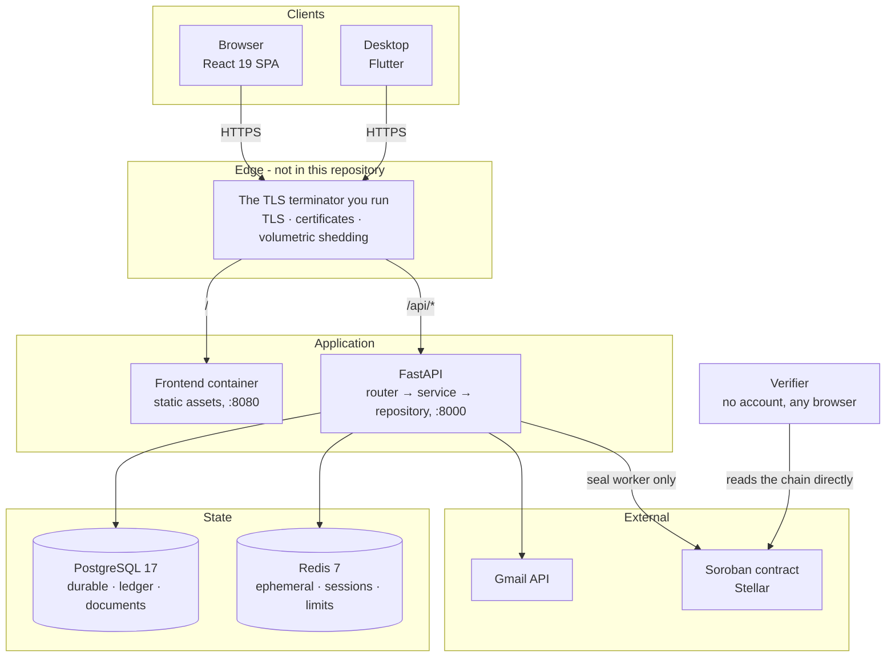
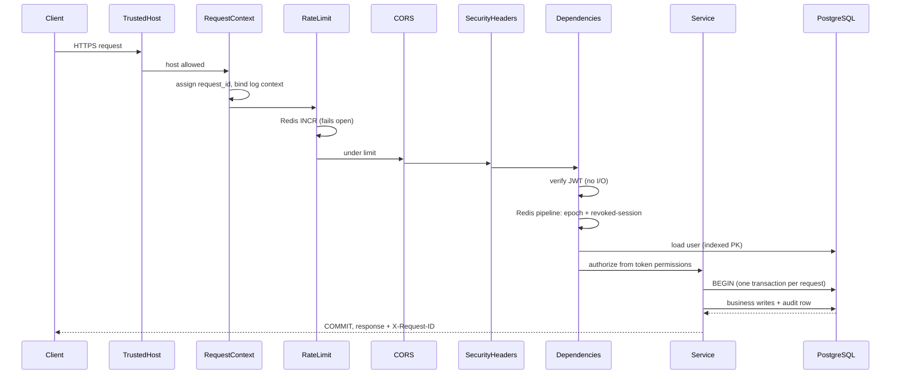
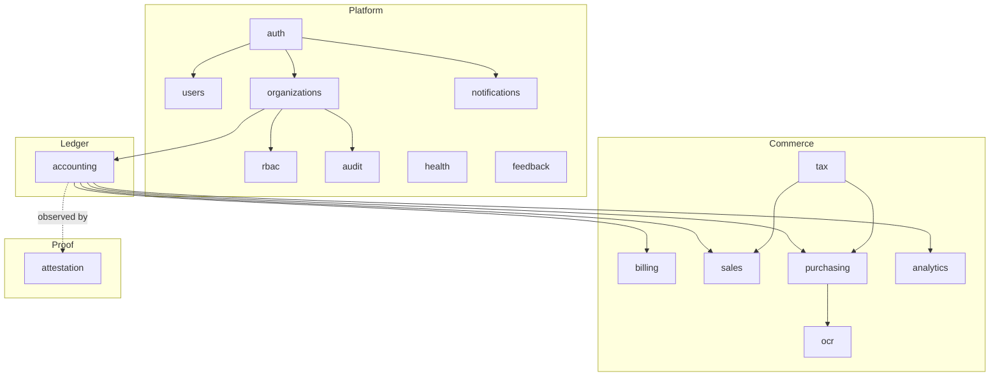

<div align="center">

# Architecture

**Layering, the request lifecycle end to end, and how fifteen modules fit together.**

<!-- nav:start -->
[Docs](README.md) · [Spec](spec.md) · **Architecture** · [Database](database.md) · [Accounting](accounting.md) · [Proof ledger](attestation.md) · [API](api.md) · [Security](security.md) · [Audit](security-audit.md) · [Commands](commands.md) · [Development](development.md) · [Deployment](deployment.md)
<!-- nav:end -->

</div>

---

## Guiding principle

The dependency graph points inward. Business rules do not know how they are
invoked, and data access does not know what it is for.

```
┌──────────────────────────────────────────────────────────────┐
│ router.py     HTTP. Parse, delegate, shape the response.     │
│               Knows about FastAPI. Contains no business rule. │
├──────────────────────────────────────────────────────────────┤
│ service.py    Business rules. Raises domain exceptions.       │
│               Knows nothing about HTTP, FastAPI, or requests.  │
├──────────────────────────────────────────────────────────────┤
│ repository.py Data access. The ONLY layer touching the session.│
│               Knows nothing about business rules.              │
├──────────────────────────────────────────────────────────────┤
│ models.py     SQLAlchemy tables and their invariants.          │
└──────────────────────────────────────────────────────────────┘
```

What this buys, concretely:

- A service can be unit-tested with a fake repository - no database.
- The same services will back a CLI, a Celery worker, and a GraphQL surface in
  later stages with no changes.
- Swapping PostgreSQL for something else touches repositories only.
- `HTTPException` never appears below the router, so a service raising
  `NotFoundError` is transport-neutral.

`RequestContext` ([`core/context.py`](../backend/app/core/context.py)) is the seam
that keeps it honest: services need the caller's IP and user agent for audit
rows, and receive them as a plain value object rather than importing `Request`.

---

## System shape



**Two lines are worth reading twice.** The Stellar contract is the only external
dependency in a *write* path, and it is reached exclusively by the seal worker -
never inside a request, so consensus latency can never be in front of a user closing
a period. And the verifier's arrow does not pass through this application at all: a
proof is checked in the reader's browser against a public RPC, because a verdict
issued by the party being audited is not a verdict. See
[Proof ledger](attestation.md).

**The edge is dashed for a reason: nothing in this repository is it.** TLS is
terminated by whatever the operator already runs in front of the stack.
`docker-compose.prod.yml` publishes the
two HTTP ports above on loopback and stops there - see
[Deployment](deployment.md#3-tls---in-front-of-the-stack).

The API process is stateless regardless. Everything that must survive a restart is in
PostgreSQL; everything short-lived is in Redis. That is what allows instances to be
added, removed, or restarted independently - and the only thing currently missing for
horizontal scale is something to balance across them.

### What lives where, and why

| Data | Store | Reasoning |
| --- | --- | --- |
| Users, organizations, roles, memberships, invitations, audit | PostgreSQL | Must be durable, relational, and queryable |
| Session rows (refresh-token digests, device history) | PostgreSQL | Must survive restarts; users audit their own devices |
| One-time tokens (verification, magic link), emailed codes (sign-in, password reset), pending device sign-ins | Redis | Naturally TTL'd - expiry as a feature, no cleanup job |
| Failed-login counters and lockouts | Redis | Ephemeral by definition; losing them fails safe |
| Token epoch counters | Redis | Read on every request; must be a single fast GET |
| Revoked-session markers | Redis | Same - a per-request check cannot be a SQL query |
| Rate-limit windows | Redis | High write volume, zero durability requirement |

Losing Redis entirely degrades the service (users re-authenticate, rate limiting
fails open) but never corrupts it.

---

## Request lifecycle

Middleware is registered in reverse execution order in
[`main.py`](../backend/app/main.py). Actual inbound order:



Ordering rationale:

- **Request id first**, so every later layer - including a rate-limit rejection -
  can be correlated.
- **Rate limiting before any handler work**, so a flood costs one Redis `INCR`
  rather than a database query.
- **Security headers outermost on the way out**, so they are present on *every*
  response, including errors raised deep in the stack.

### Cost of authenticating one request

1. JWT verification - no I/O.
2. One pipelined Redis round trip - token epoch + revoked-session check.
3. One indexed primary-key lookup for the user row.

Authorization itself is free: permissions were embedded in the token at issue
time, so it is a set-membership test.

### Transaction boundary

One request, one transaction. [`get_db`](../backend/app/db/session.py) yields a
session, commits if the handler returns, rolls back if it raises. Services call
`flush()`, never `commit()`.

The payoff: a request that writes a journal entry and its audit row either
persists both or neither. Partial writes are impossible by construction - which
matters more in accounting than anywhere else.

---

## Modules

Sixteen modules, in four tiers. An arrow is a real domain dependency, not an
import of convenience.



**The dashed arrow is the only one in the diagram, and it points the way it does on
purpose.** `attestation` depends on `accounting`; `accounting` does not know
`attestation` exists.

`core` depends on nothing in `modules`. Modules depend on `core` and, where a
real domain relationship exists, on each other - `organizations` needs `rbac`
because a membership holds a role.

**Everything commercial points at `accounting`, and never the reverse.** An invoice
is not a record that resembles a ledger entry; issuing one *is* two postings plus a
tax line. `PostingService.post_simple` is the single contract they all call, which is
why the ledger had to be stable before any of them were built.

`attestation` is the one module that is **not** called by anything. It *observes*.
See [Why accounting does not import attestation](attestation.md#why-accounting-does-not-import-attestation)
for the seam, and the paragraph below for the shape of it.

`ocr` is the one module that depends on another module's *service* rather than the
ledger: confirming a scanned document calls `BillService.create`, the same entry
point `POST /bills` uses. It has no posting path of its own, deliberately - a second
one would eventually diverge, and the divergence would be in code that writes to the
ledger.

### The observer seam

`PostingService.post_entry` finishes by calling
[`notify_entry_posted`](../backend/app/modules/accounting/hooks.py), which walks a
list of callbacks that is **empty unless something registered one**. Attestation
registers at the composition root - `install_attestation_hooks()` in `create_app` -
and nowhere else.

Two properties make this safe to put at the end of a posting:

- **It runs in the caller's transaction.** A leaf recorded for an entry that then
  rolls back would be a commitment to something that never happened.
- **It can never fail the caller.** A hook that raises is logged and swallowed. The
  journal is the system of record; a business must be able to post an invoice while
  the proof ledger is misconfigured, unreachable, or switched off.

The alternative - calling `SealService` directly from `PostingService` - was
rejected because it makes the accounting core undeployable without the blockchain
subsystem, and inverts the dependency this whole document is about.

Cross-module imports use string-based SQLAlchemy relationships
(`"OrganizationMember"`) to avoid import cycles;
[`db/registry.py`](../backend/app/db/registry.py) imports every model so those
resolve, and so Alembic autogenerate sees the full schema.

---

## Frontend architecture

```
main.tsx
  └── App.tsx
        QueryClientProvider          server-state cache
          ThemeProvider              light/dark/system
            AuthProvider             session, permissions
              RouterProvider         guards read auth from router context
              Toaster
```

Provider order is load-bearing: `AuthProvider` calls `useQueryClient` to clear
the cache on sign-out, so it must sit inside `QueryClientProvider`.

**Auth state reaches route guards through router context, not React context.**
Guards run in `beforeLoad`, before a protected component mounts, and React context
is unreachable from there. Reading it inside the component would render the page
first and redirect after - briefly flashing content the user is not entitled to.

`isLoading` is part of that context and matters: during the initial silent
refresh we do not yet know whether a session exists, and redirecting on
`!isAuthenticated` alone would bounce a signed-in user to `/login` on every
reload.

### Server state vs client state

- **Server state** - TanStack Query. Cached, deduplicated, invalidated by key.
  Mutations never retry automatically: a retried POST can duplicate an invoice.
- **Client state** - React state and two contexts. There is no Redux; nothing in
  Stage 1 needs a global store that Query and context do not already cover.

### Design tokens

[`globals.css`](../frontend/src/styles/globals.css) defines semantic tokens
(`--surface`, `--content-muted`) rather than literal colours. Components use
`bg-surface`, never `bg-zinc-900`.

Consequences: dark mode is one set of variable overrides instead of a `dark:`
variant on every element, and rebranding is a handful of lines. Dark mode is not
an inversion - surfaces get *lighter* as they come forward, mirroring how light
behaves, and text contrast is stepped down because pure white on near-black
vibrates.

---

## Error contract

One envelope for every failure, so the client has exactly one shape to parse:

```json
{
  "error": {
    "code": "permission_denied",
    "message": "You do not have permission to perform this action",
    "details": { "required_permission": "invoice:approve" },
    "request_id": "01930f4c-8a2b-7c1d-9e3f-4a5b6c7d8e9f"
  }
}
```

`code` is a stable machine-readable slug - clients branch on it, never on the
human-facing `message`.

Services raise semantic exceptions (`NotFoundError`, `BusinessRuleError`);
handlers registered in [`core/exceptions.py`](../backend/app/core/exceptions.py)
map them to responses. A `SQLAlchemyError` becomes an opaque 503 rather than
leaking SQL, and an `IntegrityError` on a unique constraint becomes a 409 -
because when two concurrent signups race past the application-level check, the
database constraint is the real arbiter.

`request_id` ties the response to the backend log lines for that exact request,
which is what makes a user's bug report actionable.

---

## Extending it

Adding a module (say, invoices in Stage 3):

1. `modules/invoices/models.py` - tables, using `OrgScopedMixin` for tenancy.
2. Import them in `db/registry.py` - **the same commit**, or autogenerate
   silently omits them.
3. Add permissions to the `Permission` enum and a `PermissionGroup`. The
   permission-group test asserts every permission belongs to exactly one group,
   so a forgotten entry fails the suite.
4. `repository.py`, `schemas.py`, `service.py`, `router.py`.
5. Mount the router in `api/v1/router.py`.
6. `make migration m="add invoice tables"`, then review the generated SQL.
7. Tests. Include the cross-tenant isolation case.

Step 3 is the one people skip. Because permissions live in code, a capability
without a catalogue entry cannot be granted through the UI at all.

<!-- related:start -->

---

## Related reading

- [Database](database.md) - the schema the persistence layer maps to
- [API](api.md) - the contract the outermost layer publishes
- [Development](development.md) - conventions, and how to add a module
- [Proof ledger](attestation.md) - the hook seam that lets a module observe accounting without accounting knowing it exists

[All documentation](README.md)
<!-- related:end -->
