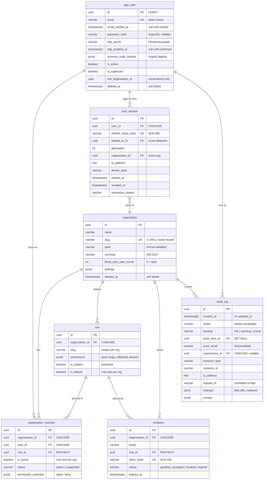

<div align="center">

# Database

**The schema, the indexes and why each exists, migrations, transactions, backups.**


<!-- nav:start -->
[Docs](README.md) · [Spec](spec.md) · [Architecture](architecture.md) · **Database** · [Accounting](accounting.md) · [Proof ledger](attestation.md) · [API](api.md) · [Security](security.md) · [Audit](security-audit.md) · [Commands](commands.md) · [Development](development.md) · [Deployment](deployment.md)
<!-- nav:end -->

</div>

---

PostgreSQL 17, plus Alembic's `alembic_version`.

**The diagram below covers the foundation tables only** - users, organizations, roles,
memberships, sessions, invitations, audit. Those are the ones whose constraints are worth
reading in full, and they are stable. The commercial modules add their own tables under
the same conventions, and the authoritative shape of those is the models themselves:
`backend/app/modules/<name>/models.py`.

---

## Entity relationships



---

## Conventions

### UUIDv7 primary keys

Random UUIDs scatter B-tree inserts across the whole index; UUIDv7 embeds a
48-bit millisecond timestamp in its high bits, so inserts append to the right edge
while keys stay non-guessable and safe in URLs.

This is also what makes cursor pagination cheap: `WHERE id < :cursor ORDER BY id
DESC` is simultaneously a chronological sort and a primary-key seek, with no
composite `(created_at, id)` cursor.

Python 3.13 has no `uuid.uuid7()`, so it is assembled in
[`db/base.py`](../backend/app/db/base.py) per RFC 9562 and covered by tests
asserting version, variant, ordering, and timestamp round-trip.

The column also has `server_default gen_random_uuid()` as a fallback for raw SQL
inserts. Those yield a v4 - only ORM inserts get the time-ordered v7.

### Constraint naming convention

Every constraint is named by a `MetaData` naming convention. Without it PostgreSQL
invents names, Alembic autogenerate cannot find them again, and a later migration
cannot drop or alter them. This is the difference between a schema that stays
migratable for years and one that does not.

### Enums as VARCHAR + CHECK

`native_enum=False` everywhere. Adding a value to a PostgreSQL native `ENUM`
requires `ALTER TYPE`, which cannot run inside a transaction on older versions and
is awkward to reverse. A check constraint is a one-line, fully reversible
migration.

### Soft deletion

`app_user` and `organization` carry `deleted_at`. Statutory retention means a
company's ledger must remain recoverable long after they stop paying, and an
accidental deletion of an entire book of accounts has to be reversible.

`BaseRepository` filters `deleted_at IS NULL` by default so no subclass has to
remember. Forgetting that filter in one query is how "deleted" customers reappear
on an invoice.

**Recoverable does not mean there is an undo button.** Money accounts and cards have
`/restore` endpoints; `organization` and `app_user` have none, so a deleted organization
comes back only by clearing the column directly:

```sql
UPDATE organization SET deleted_at = NULL WHERE id = '...';
```

That is deliberate - restoring a whole company's books is not an action to expose behind a
button someone can press twice - but it does mean the operator is the only person who can
do it, and the clients say exactly that rather than implying support can help.

Join rows (`organization_member`) *are* hard-deleted - they are not business
documents, and the audit trail preserves the fact that the person was there.

### Table naming

Singular `snake_case`, derived automatically from the class name.

One documented exception: the user table is `app_user`, because `user` is a
reserved word in PostgreSQL. SQLAlchemy would quote it correctly, but every
hand-written query, psql session, and BI tool downstream would have to remember
the quotes.

---

## Indexes

Beyond the primary keys and unique constraints:

| Index | Purpose |
| --- | --- |
| `ix_app_user_email` (unique) | Login lookup - the hottest query in the system |
| `ix_app_user_active` partial `WHERE deleted_at IS NULL` | Active-user scans skip deleted rows entirely |
| `ix_organization_slug` (unique) | Slug resolution |
| `uq_member_org_user` | A user joins an organization at most once |
| `uq_member_single_owner` partial `WHERE is_owner IS TRUE` | Exactly one owner per organization, enforced by the database |
| `uq_role_org_slug` | Role slugs unique per tenant |
| `uq_role_single_default` partial `WHERE is_default IS TRUE` | One default role per organization |
| `uq_invitation_pending_email` partial `WHERE status = 'pending'` | One live invitation per address; history preserved |
| `ix_user_session_refresh_token_hash` (unique) | Refresh lookup |
| `ix_user_session_active` partial `WHERE revoked_at IS NULL` | "List my sessions" and bulk revocation |
| `ix_audit_log_org_created` | The audit viewer's default query |
| `ix_audit_log_actor_created` | "What did this person do?" |
| `ix_audit_log_resource` | "What happened to this record?" |
| `ix_seal_leaf_unsealed` partial `WHERE seal_id IS NULL` | The seal worker's only hot query: what still needs sealing |
| `uq_seal_leaf_org_seq` | A journal entry occupies exactly one position in the Merkle sequence |
| `uq_seal_org_seq_live` partial `WHERE status <> 'failed'` | One live seal per sequence number |
| `uq_seal_org_last_leaf` partial `WHERE status <> 'failed'` | One live seal per leaf range |
| `uq_attestation_setting_organization_id` | One attestation configuration per organization |
| `ix_usage_event_org_created` | Analytics rollups, which are always time-bounded |

**Partial indexes are doing real work here.** `uq_member_single_owner` is the
clearest example: a plain unique index on `organization_id` would allow only one
member per organization, which is nonsense. Restricting it to
`WHERE is_owner IS TRUE` expresses exactly the intended invariant - one owner,
many members - at the database level, where application code cannot bypass it. A
test asserts a second owner insert raises `IntegrityError`.

The same technique gives `uq_invitation_pending_email` its meaning: an address can
have many *historical* invitations but only one *pending* one.

`uq_seal_org_last_leaf` was **unconditional at first, and that was a defect.** A seal
whose submission failed still held its leaf range, so the replacement seal - which
must cover exactly the same entries - could never be inserted. One network timeout
stopped that organization from ever sealing again. The `WHERE status <> 'failed'`
predicate says what was actually intended: a range may be claimed once
*successfully*, and any number of times unsuccessfully. `uq_seal_org_seq_live` is
partial for the same reason, and the test that found it is
`test_a_failed_seal_lets_its_sequence_be_reused`. See
[Proof ledger](attestation.md) for why a gap in that sequence is not a recoverable
inconvenience but indistinguishable from evidence of tampering.

---

## Migrations

Alembic, run over asyncpg via `connection.run_sync`.

The obvious alternative - strip `+asyncpg` from the DSN and let SQLAlchemy fall
back to psycopg2 - means installing and maintaining a second PostgreSQL driver
whose only job is migrations, and being exposed to behavioural differences between
the two exactly where correctness matters most.

### Workflow

```bash
make migration m="add invoice tables"   # autogenerate
# review the generated file - always
make migrate                            # apply
make db-check                            # assert no drift
make rollback                            # undo the last one
```

### What to run before pushing

Four separate checks, because they catch different mistakes:

```bash
alembic upgrade head      # the migration applies
alembic downgrade base    # it is reversible
alembic upgrade head      # and re-applies cleanly
alembic check             # models and migrations agree
```

`alembic check` is the important one: it fails when someone changes a model
without generating a migration. Without it, the drift is discovered on the next
deploy against a schema that no longer matches the code.

> **Nothing enforces this for you.** CI has no backend job, so a migration that does
> not reverse will merge. `make db-check` is the local gate - run it.

`compare_type` and `compare_server_default` are both enabled in
[`migrations/env.py`](../backend/migrations/env.py). Both are off by default, and
their absence is the usual reason "autogenerate found nothing" when a column's
type really did change.

### Registering models

`Base.metadata` only knows about classes that have been imported.
[`db/registry.py`](../backend/app/db/registry.py) imports every model, and adding
one there must happen in the same commit as the model itself - otherwise
autogenerate silently omits the table and produces an empty migration.

---

## Transactions

One request, one transaction. `get_db` commits on success and rolls back on any
exception; services call `flush()` to obtain primary keys and surface constraint
violations, never `commit()`.

A request that writes a journal entry and its audit row either persists both or
neither.

Audit rows join the caller's transaction deliberately: if the action rolls back,
its audit row must roll back too, or the trail describes events that never
occurred.

---

## Test isolation

Every test runs in a transaction that is always rolled back.
`join_transaction_mode="create_savepoint"` means the application's own `commit()`
calls become savepoint releases, so production code runs its real transaction
boundaries while the outer rollback still erases everything.

Truncating tables between tests would be slower, would race under parallel
execution, and would leave sequences and cached plans behind. Rollback gives
byte-identical starting state every time.

The test schema is built with `create_all`, not `alembic upgrade head` - the schema
under test should be the one the models describe, so a stale migration cannot make
the suite pass against a schema the code no longer matches. Migration correctness
is verified separately by `alembic check`.

---

## Backups

`make backup` runs `pg_dump --format=custom` inside the postgres container and
writes to `./backups`. Custom format because it is compressed and allows selective
restore via `pg_restore` - a plain SQL dump is all or nothing.

Two details that matter:

- The archive is written to `.partial` and renamed on success, so an interrupted
  run never leaves a truncated file that looks like a valid backup.
- Every archive is **verified** immediately with `pg_restore --list`, before that
  rename. A backup that has never been read back is a guess, not a backup.

Run it before every deploy and on a nightly cron - see
[Deployment](deployment.md#5-backups).

`make restore f=<dump>` requires typing the database name to confirm, stops the API
first, restores inside a single transaction, then re-applies any migrations newer
than the backup.

Both run through the container rather than a script tree, so there is nothing to
install on the server and nothing that can drift out of step with the compose file.

Uploaded documents live in PostgreSQL as compressed blobs, so one dump captures the
ledger and the scans supporting it at a single consistent moment. There is no second
volume to remember, which is the whole reason that storage decision was made.

<!-- related:start -->

---

## Related reading

- [Accounting](accounting.md) - why the ledger tables are shaped the way they are
- [Architecture](architecture.md) - where persistence sits in the layering
- [Deployment](deployment.md) - backups, restores, and running migrations on a server
- [Proof ledger](attestation.md) - the three tables behind the seals, and why two of their indexes are partial

[All documentation](README.md)
<!-- related:end -->
