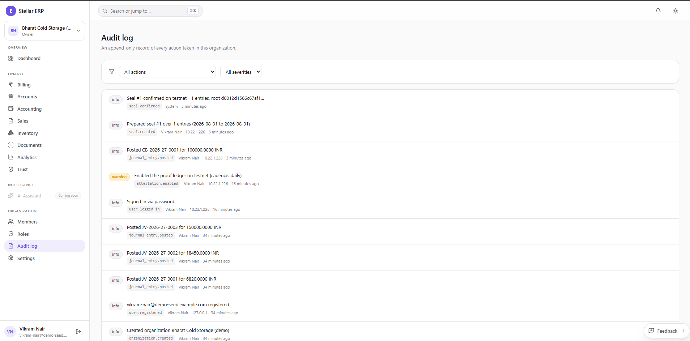
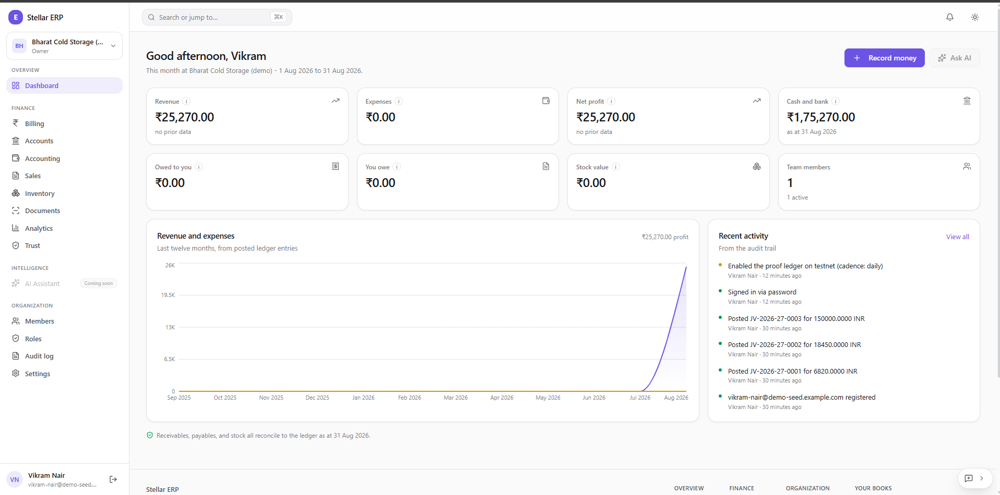
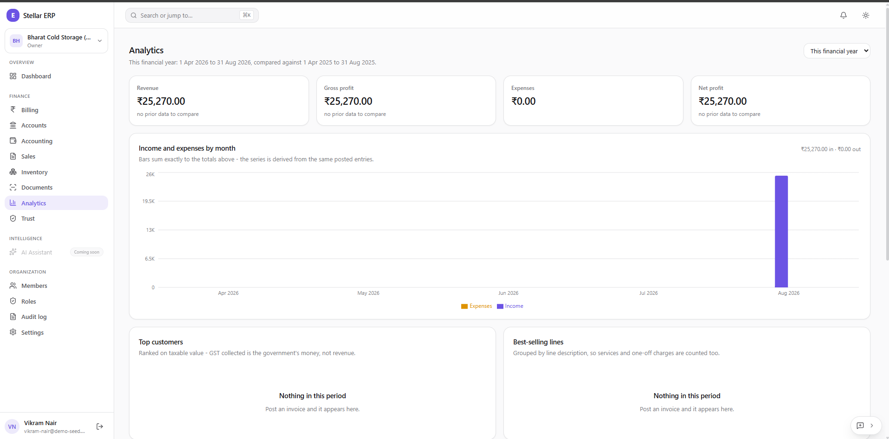
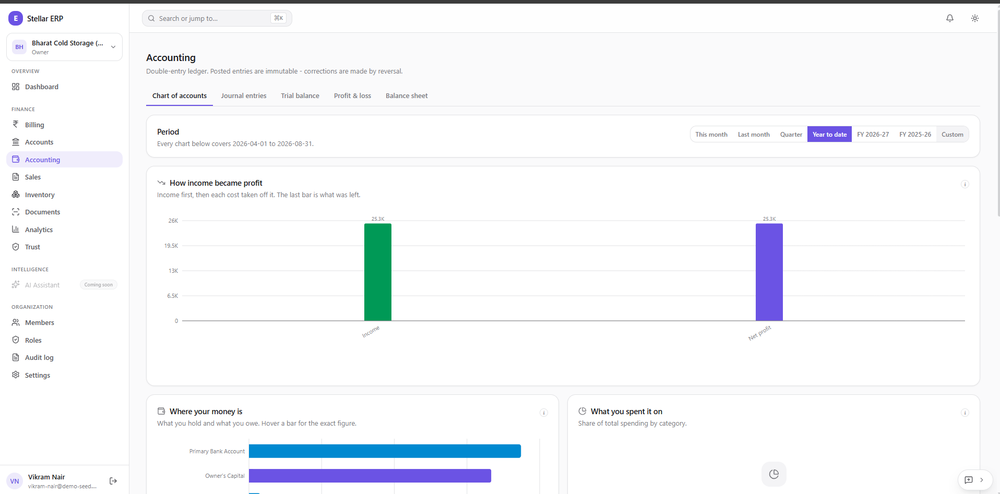
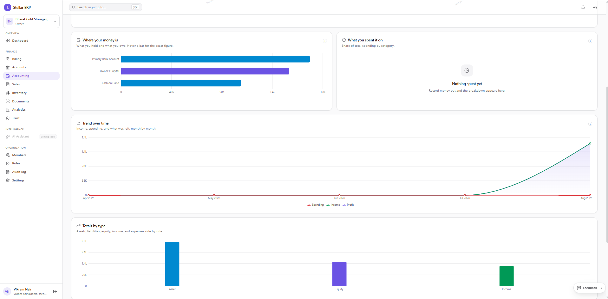
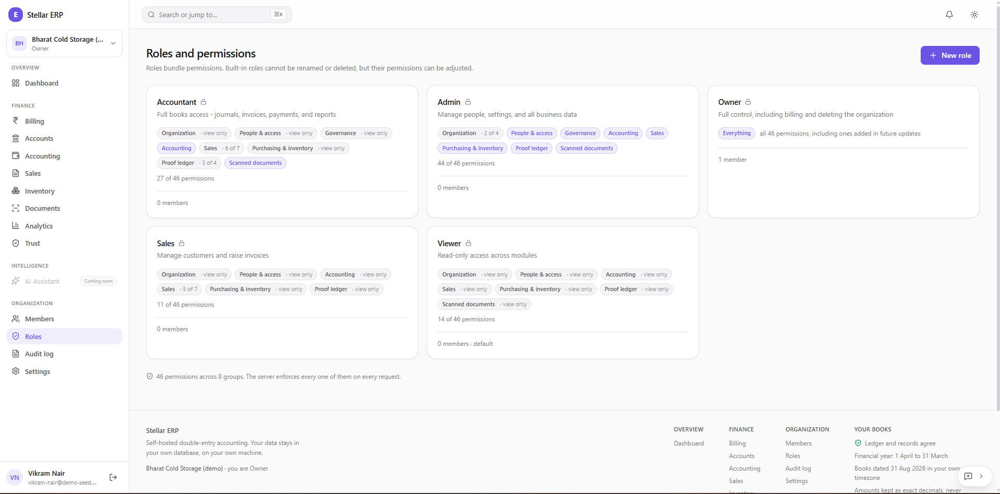
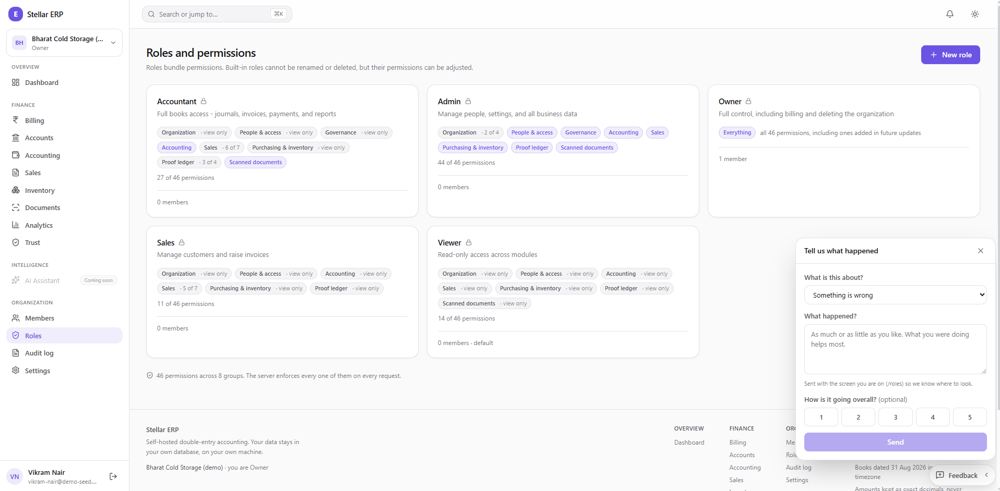

# Screenshots

**The interface, shot by shot - and why each shot rather than another.**

<!-- nav:start -->
[Docs](README.md) · [Spec](spec.md) · [Architecture](architecture.md) · [Database](database.md) · [Accounting](accounting.md) · [Proof ledger](attestation.md) · [API](api.md) · [Security](security.md) · [Audit](security-audit.md) · [Commands](commands.md) · **Screenshots** · [Demo video](demo-video.md) · [Evidence](evidence.md) · [Development](development.md) · [Deployment](deployment.md)
<!-- nav:end -->

---

Eight captured, three outstanding. The [root README](../README.md#screenshots) carries
four; this page carries all of them at full size.

Every shot is a real install - `Bharat Cold Storage (demo)` is a seeded organization
written by `scripts/seed_demo.py`, which is [why the figures are small and why that is
fine](evidence.md): seeded rows are honest for a screenshot and are explicitly not
evidence.

> **The three outstanding shots are the important ones.** They are the public verifier
> passing, the verifier failing on a tampered bundle, and a mobile viewport - listed in
> [Outstanding](#outstanding) rather than quietly omitted, because the first two are
> the product's actual argument and the third is a submission requirement.

---

## Captured

### 1 · Trust - the third ledger

The product's whole argument in one screen.

<code>product-ui.png</code> · signed in, sealing <b>on</b>

What earns it the first slot:

| In frame | Why it matters |
| --- | --- |
| **Seal #1, `On chain`,** with a `transaction` link | The link resolves on Stellar Expert, off our infrastructure - the reader checking us rather than believing us |
| **`Unbroken chain`** and `CHAIN #1` | The contract refuses a skipped sequence, so a gap would be evidence rather than an absence |
| **`WAITING TO BE SEALED · 0`** | The figure that says sealing is actually running. "Entries sealed" alone is reassuring and says nothing about *now* |
| The **amber banner**, top of screen | *"The signing key is held on this server, so a seal proves the books have not changed since it was written - not that they were correct when it was."* |
| `proves 1 entry with 0 hashes` | A one-entry batch needs no siblings. The Merkle path grows as `log₂(n)`, and this is `n = 1` |

That banner is the honest limitation, and it sits at the **top** of the screen rather
than in a footnote. A screenshot cropped to exclude it would sell a stronger product
than this one is.

---

### 2 · Audit log - Ledger 2

<code>audit-log.png</code> · unfiltered, newest first

The second ledger, and the best single proof that sealing is a *lifecycle* rather than
a button. Read top down:

`seal.confirmed` → `seal.created` → `journal_entry.posted` → `attestation.enabled`

Each row carries actor, IP and time. `attestation.enabled` is logged at **`warning`**
severity rather than `info` - turning the proof ledger on is a governance event, and
the severity says so. This record has no `updated_at` column, which is the point: a log
that can be edited is not evidence.

---

### 3 · Dashboard

<code>dashboard.png</code> · signed in, seeded organization

The ERP underneath the argument - worth having because the third ledger only means
something if there is a real double-entry system beneath it.

**Recent activity is read off the audit trail**, not a separate feed, so the same
append-only record from shot 2 is what the owner sees on the landing screen. The line
at the bottom - *"Receivables, payables, and stock all reconcile to the ledger as at
31 Aug 2026"* - is a control reconciliation, not a decoration.

---

### 4 · Analytics

<code>analytics.png</code> · this financial year vs. last

Satisfies the submission checklist's *analytics* requirement.

The header states the comparison window explicitly - `1 Apr 2026 to 31 Aug 2026,
compared against 1 Apr 2025 to 31 Aug 2025` - and the tiles read **"no prior data to
compare"** rather than rendering a fabricated or zeroed delta. The note under the chart
is the one that matters: *"Bars sum exactly to the totals above - the series is derived
from the same posted entries."*

> **This shot is thin, and it is thin honestly.** A young seeded install has no prior
> year and no invoices, so *Top customers* and *Best-selling lines* both read "Nothing
> in this period". [Outstanding](#outstanding) says what a stronger version needs.

---

### 5 · Accounting

<code>accounting.png</code> · Chart of accounts tab, year to date

The double-entry core. The subtitle is the whole accounting policy in one line:
**"Posted entries are immutable - corrections are made by reversal."**

Five tabs - Chart of accounts, Journal entries, Trial balance, Profit & loss, Balance
sheet - and a period selector carrying real fiscal years (`FY 2026-27`, `FY 2025-26`)
rather than rolling windows, because Indian statutory reporting is fiscal-year shaped.

---

### 6 · Accounting - the lower charts

<code>accounting-charts.png</code> · the same screen, scrolled

Kept because it shows what shot 5 cuts off: *Where your money is*, *Trend over time*,
and *Totals by type*. Every panel names its own basis in the subtitle, and the empty one
says **"Nothing spent yet - record money out and the breakdown appears here"** rather
than drawing an empty donut.

---

### 7 · Roles and permissions

<code>roles.png</code> · five built-in roles

**46 permissions across 8 groups**, and the footer states where they are enforced:
*"The server enforces every one of them on every request."* That sentence is the claim
worth checking - a permission model enforced only in the client is decoration.

Note `Proof ledger · 3 of 4` on Accountant against `view only` on Viewer: the third
ledger is permissioned like every other module rather than being an owner-only escape
hatch.

---

### 8 · Feedback widget

<code>feedback.png</code> · the widget open over Roles

Evidence for the submission's *user feedback* item. Two details make it real: it says
**"Sent with the screen you are on (/roles) so we know where to look"**, and it works
signed out, landing in `POST /feedback`.

---

## Outstanding

Three shots, and they are the three that matter most.

### A · The verifier, passing - `verify.png`

**The single most important missing shot.** Everything captured above is a signed-in
user looking at their own data, which proves nothing to a third party. This one is the
product.

Capture it in a **private window, signed out**, at
<https://stellar-erp-sigma.vercel.app/verify> - the hosted verifier needs no backend, so
no local stack is required. Must show the **five-step verdict** and the **editable RPC
field**. No avatar in the corner: a visible session quietly contradicts the "no account"
claim.

### B · The verifier, failing - `verify-tampered.png`

**Anything can render a green tick.** Take the bundle from A, change **one digit** of
one amount, re-verify, and capture the failure naming the step it failed at - the
recomputed leaf no longer folds to a root that was published before the edit was made.

[Commands § 7](commands.md#7-demonstrating-that-the-records-are-tamper-evident) is the
exact sequence. This is the moment the [demo video](demo-video.md) is built around, and
the pair A + B says more than the other eight combined.

### C · Mobile - `mobile.png`

**A submission requirement** (checklist item 6: *mobile responsive*). 390 × 844, the
Trust screen, device toolbar on. Must show nothing clipped, **no horizontal scroll**,
and the settings controls stacked rather than side by side. Scroll the page fully before
capturing - a layout that only breaks below the fold still breaks.

### Optional: making the analytics shot stronger

Shot 4 is honest but sparse. To make it carry real figures, post a few GST invoices
across two or three months before re-capturing, so *Top customers* and *Best-selling
lines* populate and the monthly chart shows more than one column. Do **not** fabricate a
prior year to fill the comparison - "no prior data to compare" is the correct output for
an install this age.

### Also worth having, not required

`monitoring.png` - `GET /attestation/status`, showing `days_unsealed` and
`chain.agrees_with_local`. Those two figures are the difference between *sealing works*
and *sealing stopped silently three weeks ago and nothing said so*.

`desktop.png` - the Flutter client in a native window with the OS title bar in frame,
the cheapest way to show it is not a wrapped web page.

---

## Rules

| Rule | Why |
| --- | --- |
| **Light theme** | Consistency across the set, and light survives being pasted into a document or a slide |
| **~1916 × 945 desktop, 390 × 844 mobile** | The captured set is already consistent at this size; match it rather than mixing |
| **PNG, not JPEG** | Text and thin borders - JPEG artefacts around UI type read as a rendering bug |
| **Real data, or an honest empty state** | A mocked-up figure is an invented artifact in a repository whose entire subject is verifiable records |
| **Redact by re-seeding, never by blurring** | If a value cannot be shown, seed data that can. A blur box reads as something hidden |
| **No bookmarks bar, no notifications** | They date the shot and leak whatever else was open |
| **Keep the URL bar on `/verify`** | There the address is part of the claim: it shows the reader is on a page, not inside our app |

**Producing the states:** `make up`, then `python scripts/seed_demo.py` if the install is
empty, then [Commands § 7](commands.md#7-demonstrating-that-the-records-are-tamper-evident)
for shots A and B. The [demo video](demo-video.md) covers the same ground in motion, and
its take will already contain those frames - pulling stills from it is step 3 of that
checklist.

---

## Where they are used

| Consumer | Shots |
| --- | --- |
| [Root README](../README.md#screenshots) | Trust, Audit log, Dashboard, Analytics - the four-slot grid |
| [SUBMISSION.md](../SUBMISSION.md#screenshots) | Trust, Analytics and Feedback captured; verifier and mobile outstanding |
| This page | All eight, plus the three still to capture |

Adding a shot means dropping the file in [`screenshots/`](screenshots/) and adding a
section here. Only promote it into the README if it earns one of the four slots.

---

**Next:** [Demo video](demo-video.md) - the same story in motion · [Commands](commands.md) - how to produce the states above · [Evidence](evidence.md) - why seeded rows are not evidence

