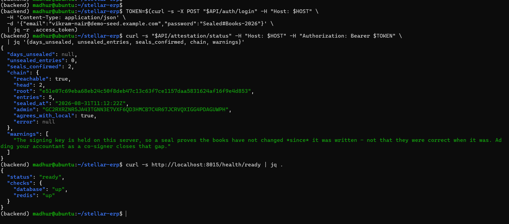

# Screenshots

**The interface, shot by shot — and why each shot rather than another.**

<!-- nav:start -->
[Docs](README.md) · [Spec](spec.md) · [Architecture](architecture.md) · [Database](database.md) · [Accounting](accounting.md) · [Proof ledger](attestation.md) · [API](api.md) · [Security](security.md) · [Audit](security-audit.md) · [Commands](commands.md) · **Screenshots** · [Demo video](demo-video.md) · [Evidence](evidence.md) · [Development](development.md) · [Deployment](deployment.md)
<!-- nav:end -->

---

The [root README](../README.md#screenshots) carries four of these. This page carries
all of them at full size, with the capture recipe underneath each one.

Files live in [`screenshots/`](screenshots/). Until one is dropped in, its slot below
renders as alt text — that is the intended behaviour, not a broken link, and it is why
every slot names the file it is waiting for.

Live instance to shoot: **<https://stellar-erp-sigma.vercel.app>**. The verifier there
works with no backend at all, so shots 2 and 3 can be taken against the public
deployment; the rest need a signed-in session against a backend, which means a local
`make up` or your own server.

> **Shoot the live app, not a mock.** Every figure in these shots comes from a real
> install talking to a real contract. If a screen has nothing in it yet, the honest
> shot is the empty state — see [Rules](#rules).

---

## 1 · Trust — the third ledger

The product's whole argument in one screen.

<code>docs/screenshots/product-ui.png</code> · 1440 × 900 · signed in, sealing <b>on</b>

**Must show, and why:**

| Element | Why it has to be in frame |
| --- | --- |
| The **backlog age** tile | It is the number that says whether sealing is actually running. A Trust screen without it is a static badge |
| A **confirmed seal** with its explorer link | The link goes to Stellar Expert, off our infrastructure. That is the reader checking us rather than believing us |
| The **"What it does not"** card | This is the honest limitation. A screenshot cropped to exclude it is selling a product that does not exist |

That third row is not a style note. The card states that a seal proves the books are
byte-identical to what was sealed — **not** that the entries were true when they were
made, and not that an operator holding the signing key could not have doctored them
before sealing. Cropping it produces a more impressive image of a weaker product.

---

## 2 · The verifier — signed out

<code>docs/screenshots/verify.png</code> · 1440 × 900 · signed <b>out</b>, one verified bundle

**Must show:** the five-step verdict, and the **editable RPC field**.

Take this in a private window with no session. The point of `/verify` is that it needs
no account, no wallet and no seed phrase, and a screenshot with a user avatar in the
corner quietly contradicts that. The RPC field matters for the same reason: it is
visible proof the reader can point the check at their own endpoint, so the verdict is
not something our API handed them.

---

## 3 · The verifier — failing

<code>docs/screenshots/verify-tampered.png</code> · 1440 × 900 · one altered digit

**The most valuable screenshot in this directory.** Anything can render a green tick.
Take the bundle from shot 2, change one digit of one amount, re-verify — and the
failure names the step it failed at, because the recomputed leaf no longer folds to a
root that was published before the edit was made.

[Demonstrating tamper-evidence](commands.md#7-demonstrating-that-the-records-are-tamper-evident)
is the exact sequence.

---

## 4 · Mobile

<code>docs/screenshots/mobile.png</code> · 390 × 844 · device toolbar, Trust screen

**Must show:** nothing clipped, **no horizontal scroll**, and the settings controls
stacked rather than side by side. Scroll the page all the way before capturing — a
layout that only breaks below the fold still breaks.

---

## 5 · Analytics

<code>docs/screenshots/analytics.png</code> · 1440 × 900

**Must show:** real figures with a like-for-like comparison beside them. A dashboard of
zeroes proves the page renders; a dashboard with a period-on-period comparison proves
the numbers are computed.

If the install is freshly seeded, say so — seeded rows are marked, and
[`docs/evidence.md`](evidence.md) explains why they are fine for a screenshot and are
not evidence.

---

## 6 · Monitoring

<code>docs/screenshots/monitoring.png</code> · <code>GET /attestation/status</code>, or the Sentry project

**Must show:** `days_unsealed` and `chain.agrees_with_local`.

Those two figures are the entire difference between *sealing works* and *sealing
stopped silently three weeks ago and nothing said so*. A green uptime chart shows
neither.

---

## 7 · Desktop client

<code>docs/screenshots/desktop.png</code> · a native window, no browser chrome

Optional, but the cheapest way to show the desktop build is a real native window rather
than a wrapped web page — so keep the OS title bar in frame, for exactly that reason.
Where a native window honestly differs from a browser is in
[`app_frontend/README.md`](../app_frontend/README.md).

---

## Rules

These apply to every shot above.

| Rule | Why |
| --- | --- |
| **Light theme, unless the shot is about dark mode** | Consistency across the set, and light survives being pasted into a document or a slide |
| **1440 × 900 desktop, 390 × 844 mobile** | Fixed sizes make the set look deliberate rather than assembled from whatever window happened to be open |
| **PNG, not JPEG** | Text and thin borders — JPEG artefacts around UI type read as a rendering bug |
| **Real data, or an honest empty state** | A mocked-up figure is an invented artifact in a repository whose entire subject is verifiable records |
| **Redact by re-seeding, never by blurring** | If a value cannot be shown, seed data that can. A blur box reads as something hidden |
| **No bookmarks bar, no notifications** | They date the shot and leak whatever else was open |
| **Crop to content — but keep the URL bar on `/verify`** | On the verifier the address is part of the claim: it shows the reader is on a page, not inside our app |

**Producing the states:** `make up`, then `python scripts/seed_demo.py` if the install
is empty, then [Commands § 7](commands.md#7-demonstrating-that-the-records-are-tamper-evident)
for shots 2 and 3. The [demo video script](demo-video.md) covers the same ground in
motion and its take will already contain most of these frames — pulling stills from it
is step 3 of that checklist.

---

## Where they are used

| Consumer | Which shots |
| --- | --- |
| [Root README](../README.md#screenshots) | 1, 2, 4, 5 — the four-slot grid |
| [SUBMISSION.md](../SUBMISSION.md#screenshots) | 1, 2, 4, 5, 6 — checklist item 6 |
| This page | All seven, full size |

Adding a shot means dropping the file in [`screenshots/`](screenshots/) and adding a
section here. Only promote it into the README if it earns one of the four slots.

---

**Next:** [Demo video](demo-video.md) — the same story in motion · [Commands](commands.md) — how to produce the states above · [Submission](../SUBMISSION.md) — where these are required

