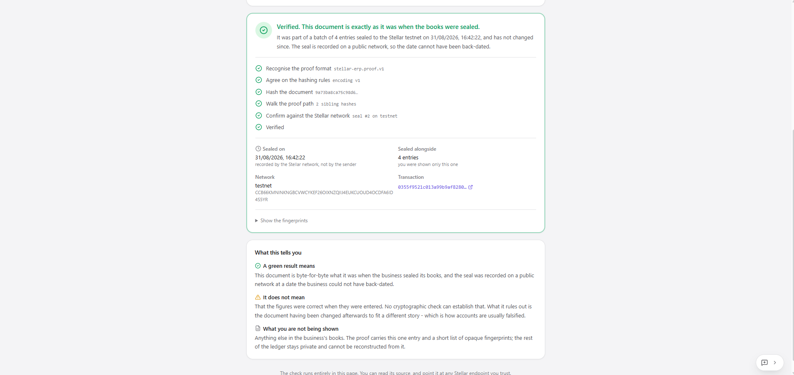
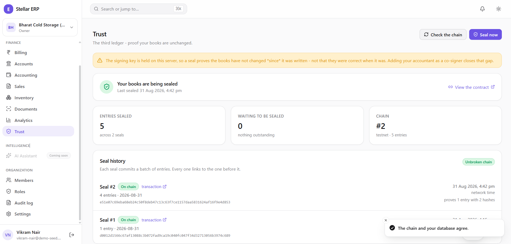
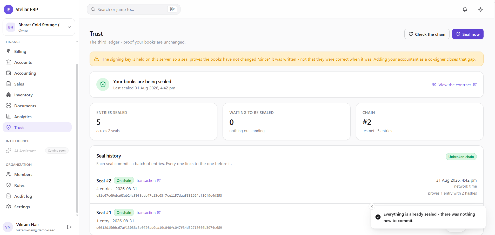
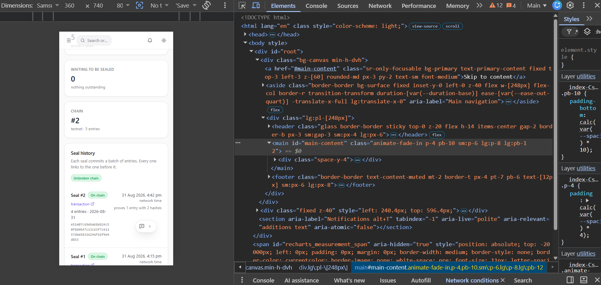
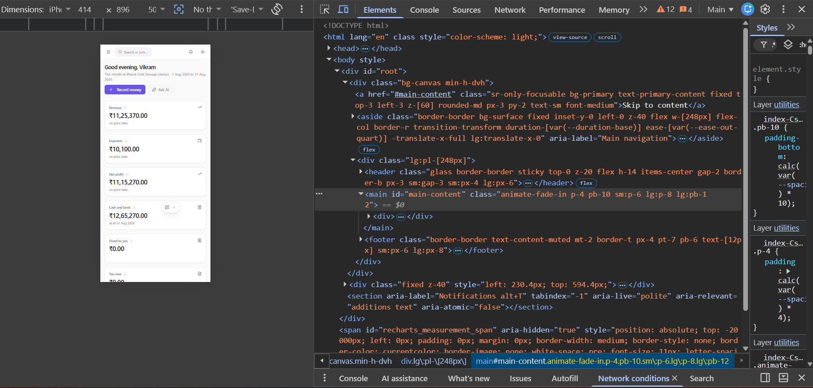
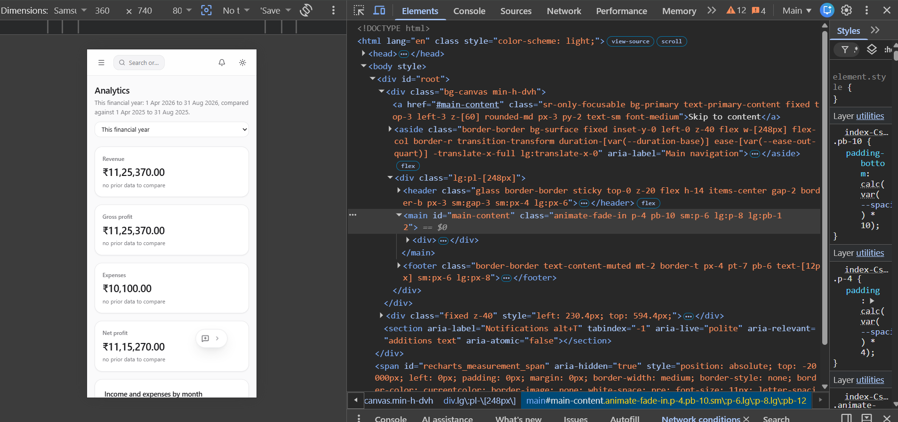
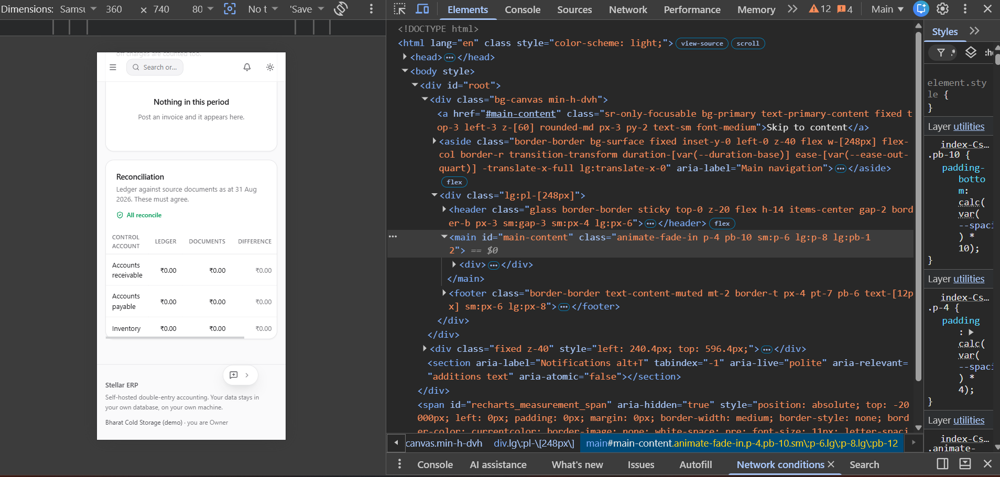
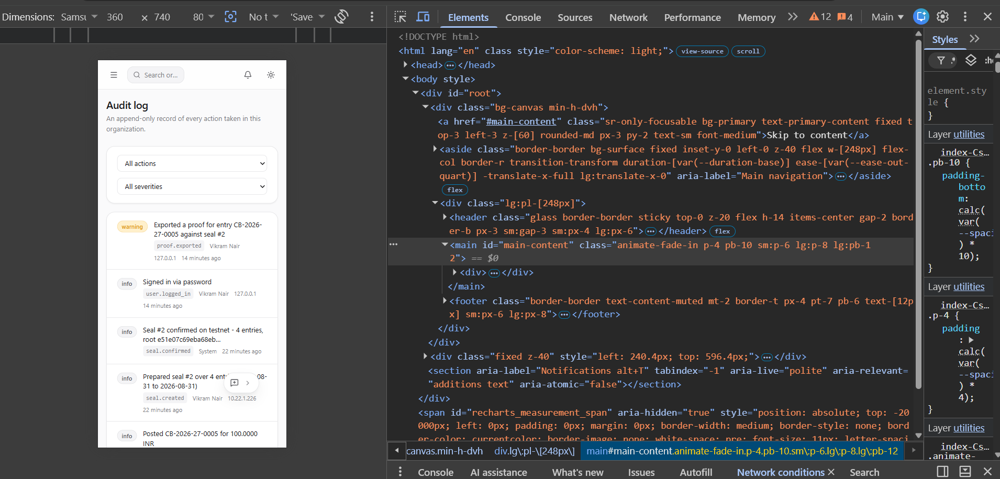
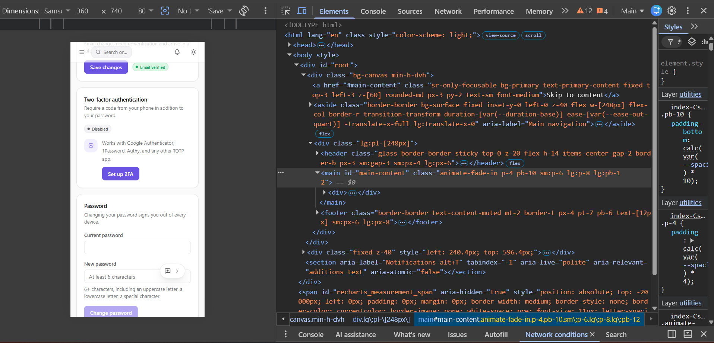

# Screenshots

**Every screen, shot by shot - and why each shot rather than another.**

<!-- nav:start -->
[Docs](README.md) · [Spec](spec.md) · [Architecture](architecture.md) · [Database](database.md) · [Accounting](accounting.md) · [Proof ledger](attestation.md) · [API](api.md) · [Security](security.md) · [Audit](security-audit.md) · [Commands](commands.md) · **Screenshots** · [Demo video](demo-video.md) · [Evidence](evidence.md) · [Development](development.md) · [Deployment](deployment.md)
<!-- nav:end -->

---

Twenty-one shots in four groups: **[the verifier](#the-verifier)** (3),
**[the product](#the-product)** (8), **[monitoring](#monitoring)** (3), and
**[mobile](#mobile)** (7). The [root README](../README.md#screenshots) carries four.

Every shot is a real install against the real testnet contract.
`Bharat Cold Storage (demo)` is a seeded organization from `scripts/seed_demo.py`,
which is [why the figures are small and why that is fine](evidence.md): seeded rows are
honest for a screenshot and are explicitly not evidence.

| Group | Files |
| --- | --- |
| [The verifier](#the-verifier) | `verify.png` · `verify-verdict.png` · `verify-tampered.png` |
| [The product](#the-product) | `product-ui.png` · `audit-log.png` · `dashboard.png` · `analytics.png` · `accounting.png` · `accounting-charts.png` · `roles.png` · `feedback.png` |
| [Monitoring](#monitoring) | `monitoring.png` · `monitoring-chain-check.png` · `seal-nothing-to-commit.png` |
| [Mobile](#mobile) | `mobile.png` · `mobile-trust-seals.png` · `mobile-dashboard.png` · `mobile-analytics.png` · `mobile-reconciliation.png` · `mobile-audit-log.png` · `mobile-settings.png` |

---

## The verifier

**This is the product.** Everything in [the product](#the-product) is a signed-in user
looking at their own data, which proves nothing to a third party. These three are the
only shots where a stranger checks the books and our servers are not in the path.

### 1 · Verified

<code>verify.png</code> · signed out · the whole flow in one frame

The paste box and the green verdict together, so one image shows input and answer.

| In frame | Why it matters |
| --- | --- |
| **"Checked in your browser, against the Stellar network"** | The subtitle is the claim |
| **"Nothing is uploaded - the check happens on your device, and the answer does not depend on trusting whoever sent you the file"** | Stated on the page, not just in our docs |
| **"Use a different Stellar endpoint"** | The RPC is the reader's choice. A scheme pitched as "you need not trust us" cannot quietly require trusting one hosted RPC |
| `Walk the proof path · 2 sibling hashes` | A real Merkle path being folded, not a one-entry tree with nothing to fold |
| `Confirm against the Stellar network · seal #2 on testnet` | The step that makes the answer independent |

### 2 · The verdict, in full

<code>verify-verdict.png</code> · scrolled to the verdict

The same check, scrolled so the honest half is readable. Two things here exist nowhere
else:

**"Sealed alongside · 4 entries · you were shown only this one."** That is selective
disclosure stated to the reader. The bank sees one invoice; the other three entries in
the batch are committed to by hashes it cannot invert.

**The "What this tells you" card**, which spends two of its three sections on limits:

> **It does not mean** — that the figures were correct when they were entered. No
> cryptographic check can establish that. What it rules out is the document having been
> changed afterwards to fit a different story - which is how accounts are usually
> falsified.
>
> **What you are not being shown** — anything else in the business's books. The proof
> carries this one entry and a short list of opaque fingerprints; the rest of the ledger
> stays private and cannot be reconstructed from it.

A trust product that oversells itself is not a trust product. This card is the proof
that the principle survived contact with the UI.

### 3 · Altered, and caught

<code>verify-tampered.png</code> · one field changed

**The most valuable shot here.** Anything can render a green tick.

`total_debit` was changed from `100.0000` to `1010.0000` - visible in the paste box, next
to a `total_credit` still reading `100.0000`. The verdict:

> **The figures in this document are not the figures that were sealed.**
> Re-hashing the entry produced a different value from the one the bundle claims.

Note **where** it fails: steps 1 and 2 (format, hashing rules) stay green and **step 3,
"Hash the document", goes red** - the recomputed fingerprint `20bfba900ea97a83…` is not
the `9a73ba8ca75c98d6…` the bundle claims. It never reaches the network, because it does
not need to. That is a failure with a nameable cause, not "the file looks wrong".

---

## The product

### 4 · Trust - the third ledger

<code>product-ui.png</code> · sealing on, two seals

| In frame | Why |
| --- | --- |
| **Seal #2 and Seal #1, both `On chain`**, each with a `transaction` link | The links resolve on Stellar Expert, off our infrastructure |
| **`Unbroken chain`** and `CHAIN #2` | Each seal links to the one before it; the contract refuses a skipped sequence, so a gap is evidence rather than an absence |
| `proves 1 entry with 2 hashes` vs `with 0 hashes` | The two seals side by side show the Merkle path growing as `log₂(n)` - Seal #1 covered one entry, Seal #2 covers four |
| **`WAITING TO BE SEALED · 0`** | The figure that says sealing is running now. "5 entries sealed" alone says nothing about now |
| The **amber banner**, at the top | *"The signing key is held on this server… Adding your accountant as a co-signer closes that gap."* |

The banner is the honest limitation, and it is the first thing on the screen rather than
a footnote. Cropping it out would sell a stronger product than this one is.

### 5 · Audit log - Ledger 2

<code>audit-log.png</code> · unfiltered, newest first

The second ledger. Read top down and the seal is a *lifecycle*, not a button:

`seal.confirmed` → `seal.created` → `journal_entry.posted` → `attestation.enabled`

`attestation.enabled` is logged at **`warning`**, not `info` - turning the proof ledger
on is a governance event and the severity says so. The table has no `updated_at` column,
which is the point: a log that can be edited is not evidence.

### 6 · Dashboard

<code>dashboard.png</code>

The ERP underneath the argument - the third ledger only means something if there is a
real double-entry system beneath it. **Recent activity is read off the audit trail**, not
a separate feed, so shot 5 is what the owner sees on the landing screen. The footer line,
*"Receivables, payables, and stock all reconcile to the ledger as at 31 Aug 2026"*, is a
control reconciliation rather than a decoration.

### 7 · Analytics

<code>analytics.png</code> · this financial year vs. last

The comparison window is stated explicitly - `1 Apr 2026 to 31 Aug 2026, compared against
1 Apr 2025 to 31 Aug 2025` - and the tiles read **"no prior data to compare"** rather
than rendering a fabricated or zeroed delta. Under the chart: *"Bars sum exactly to the
totals above - the series is derived from the same posted entries."*

### 8 · Accounting

<code>accounting.png</code> · Chart of accounts, year to date

The subtitle is the whole accounting policy in one line: **"Posted entries are immutable
- corrections are made by reversal."** Five statement tabs, and a period selector
carrying real fiscal years (`FY 2026-27`, `FY 2025-26`) rather than rolling windows,
because Indian statutory reporting is fiscal-year shaped.

### 9 · Accounting, the lower charts

<code>accounting-charts.png</code> · the same screen, scrolled

What shot 8 cuts off. Every panel names its own basis in its subtitle, and the empty one
says **"Nothing spent yet - record money out and the breakdown appears here"** rather
than drawing an empty donut.

### 10 · Roles and permissions

<code>roles.png</code> · five built-in roles

**46 permissions across 8 groups**, and the footer says where they bite: *"The server
enforces every one of them on every request."* A permission model enforced only in the
client is decoration. Note `Proof ledger · 3 of 4` on Accountant against `view only` on
Viewer - the third ledger is permissioned like every other module, not an owner-only
escape hatch.

### 11 · Feedback widget

<code>feedback.png</code> · open over Roles

Two details make it real: **"Sent with the screen you are on (/roles) so we know where to
look"**, and it works signed out - somebody who cannot get past the sign-in screen is
exactly the person whose report is worth having.

---

## Monitoring

Three shots for the checklist's *monitoring* half. Sentry is wired but **off** -
`SENTRY_DSN` is empty by default, and
[monitoring.py](../backend/app/core/monitoring.py) argues that is a requirement rather
than a gap: *"a hard dependency on a third-party error tracker would contradict [the
promise] on the same page that promises it."* So this install monitors itself.

### 12 · The two figures that matter

<code>monitoring.png</code> · <code>GET /attestation/status</code> and <code>GET /health/ready</code>

| Field | Why it is the one to watch |
| --- | --- |
| `days_unsealed: null`, `unsealed_entries: 0` | Nothing is waiting. A rising `days_unsealed` is the only early warning that sealing has quietly stopped |
| `chain.agrees_with_local: true` | The contract's head and root match this database's. Disagreement means the two ledgers have diverged - the most important alarm this system has |
| `chain.head: 2`, `chain.root: e51e07c6…` | Read back **from the contract**, not from our own tables |
| `warnings: [...]` | The signing-key limitation is returned by the **API**, not only rendered in the UI - so a monitoring integration inherits the caveat rather than losing it |
| `/health/ready` → `database: up`, `redis: up` | The ordinary liveness half. It answers with **no token and no Host header** - it is in `HOST_EXEMPT_PROBES`, because a probe reaching the app directly cannot satisfy conditions a proxy would normally arrange |

A green uptime chart shows none of this. *"The service is up"* and *"the books are still
being sealed"* are different questions, and only the second one is what this product
promises.

### 13 · Monitoring from the UI

<code>monitoring-chain-check.png</code> · after pressing <b>Check the chain</b>

The same reconciliation as a button, for an operator who is not going to curl anything:
**"The chain and your database agree."** It re-reads the contract live rather than
reporting a cached status, which is why it is a button and not a badge.

### 14 · A seal it refused to write

<code>seal-nothing-to-commit.png</code> · <b>Seal now</b> with an empty backlog

**"Everything is already sealed - there was nothing new to commit."**

Pressing the button with `WAITING TO BE SEALED · 0` writes **no transaction**. A no-op
seal would be a junk transaction on a public ledger and a lie in the seal history, where
every row is supposed to mean a batch of entries was committed. The button is
idempotent, and says so rather than appearing to work.

It is also why [`make interactions`](commands.md) exists: moving the on-chain
interaction count needs an entry posted *between* seals, not a second press.

---

## Mobile

Seven viewports, captured in Chrome's device toolbar at **360 × 740** (Samsung) and
**414 × 896** (iPhone), with the emulated dimensions visible in the toolbar.

> **These are working captures, and it shows.** The DevTools panel occupies most of each
> frame, leaving the phone viewport as a strip on the left. They are honest evidence of
> responsive testing - the emulated size is legible, which a plain crop would lose - but
> for a submission or a slide, re-capture with DevTools undocked or crop to the viewport.
> Nothing about the layout needs to change; only the framing does.

### 15 · Trust on a phone

<code>mobile.png</code> · 360 × 740 · <b>the responsive shot</b>

The submission checklist's *mobile responsive* item. Nothing clipped, no horizontal
scroll, and the tiles stacked one per row instead of three across. The amber signing-key
banner survives the narrow viewport intact rather than being hidden at small widths -
the limitation is not something the layout is allowed to drop.

### 16 · Seal history on a phone

<code>mobile-trust-seals.png</code> · 360 × 740, scrolled

`CHAIN #2`, `Unbroken chain`, and both seals with their root hashes wrapped rather than
truncated. A 64-character hash is the hardest thing on this screen to lay out narrow, and
it is readable.

### 17 · Dashboard on a phone

<code>mobile-dashboard.png</code> · 414 × 896 (iPhone)

The eight-tile figure grid collapsed to one column, amounts intact.

### 18 · Analytics on a phone

<code>mobile-analytics.png</code> · 360 × 740

The period selector becomes a full-width control, and the comparison line wraps to two
lines rather than truncating - the window a figure covers is not something to hide on a
small screen.

### 19 · Reconciliation on a phone

<code>mobile-reconciliation.png</code> · 360 × 740

**The hardest layout in the app on the narrowest viewport.** A four-column control table
- CONTROL ACCOUNT / LEDGER / DOCUMENTS / DIFFERENCE - held at 360px with `All reconcile`
still legible. Financial tables are where responsive design usually gives up and
scrolls sideways.

### 20 · Audit log on a phone

<code>mobile-audit-log.png</code> · 360 × 740

Also the best evidence for something the desktop shot predates: the top row is
**`proof.exported`, at `warning` severity** - *"Exported a proof for entry
CB-2026-27-0005 against seal #2"*.

**Exporting a proof is a disclosure event, and it is audited like one.** Handing a bundle
to a bank is the moment a business's opaque namespace stops being opaque to that bank, so
it belongs in the record at the same severity as switching sealing on. The bundle behind
[shots 1-3](#the-verifier) is the one this row is recording.

### 21 · Settings on a phone

<code>mobile-settings.png</code> · 360 × 740

Two-factor and password, with the policy stated inline. Included because security
settings are where narrow layouts usually break: inline validation text at 360px is a
real test.

---

## Rules

| Rule | Why |
| --- | --- |
| **Light theme** | Consistency, and light survives being pasted into a document or a slide |
| **~1916 × 945 desktop, 360 × 740 mobile** | The set is consistent at these sizes; match them rather than mixing |
| **PNG, not JPEG** | Text and thin borders - JPEG artefacts around UI type read as a rendering bug |
| **Real data, or an honest empty state** | A mocked-up figure is an invented artifact in a repository whose subject is verifiable records |
| **Redact by re-seeding, never by blurring** | If a value cannot be shown, seed data that can. A blur box reads as something hidden |
| **Never crop the limitation** | The amber banner on Trust and the "It does not mean" card on `/verify` stay in frame |
| **Keep the URL bar on the verifier** | There the address is part of the claim - the reader is on a page, not inside our app |

**Reproducing these:** `make up`, `python scripts/seed_demo.py` if the install is empty,
then [Commands § 7](commands.md#7-demonstrating-that-the-records-are-tamper-evident) for
the verifier pair. The [demo video](demo-video.md) covers the same ground in motion.

---

## Where they are used

| Consumer | Shots |
| --- | --- |
| [Root README](../README.md#screenshots) | `verify` · `verify-tampered` · `product-ui` · `mobile` |
| [SUBMISSION.md](../SUBMISSION.md#screenshots) | Product UI, mobile responsive and analytics, mapped to checklist item 6 |
| This page | All twenty-one |

Adding a shot means dropping the file in [`screenshots/`](screenshots/) and adding a
section here. Only promote it into the README if it displaces one of the four.

---

**Next:** [Demo video](demo-video.md) - the same story in motion · [Evidence](evidence.md) - the on-chain figures · [Proof ledger](attestation.md) - how the verifier works

